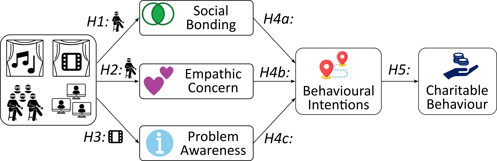
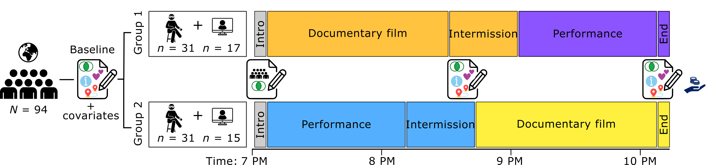

```{r env-setup, include=FALSE}
rm(list=ls())
require(pacman)
p_load('tidyverse', 'ggplot2', 'ggpubr', 'ggridges', 'ggsignif', 'here', 'lmerTest', 'car', 'psych', 'performance', 'corrplot', 'sjPlot', 'papaja', 'stringdist', 'wordcloud', 'MASS', 'pwr', 'png', 'grid', 'ltm', 'conflicted', 'effsize') # removed: GGally::ggpairs(), effectsize::cohens_d()
# car is needed for vif(), psych is needed for corr.test() and fa(), MASS is needed for polr(), ltm for cronbach.alpha()

here::i_am("Schlichting_MSc_Thesis.Rmd") # find project root

innocents_df <- read_csv(here("data/innocents_df.csv")) # load wide dataframe

source(here("src/LMMfunctions.R"), local = knitr::knit_global()) # load functions

# set preferences in case of command conflicts between loaded packages
conflicts_prefer(dplyr::select, .quiet = TRUE)
conflicts_prefer(dplyr::filter, .quiet = TRUE)
conflicts_prefer(lmerTest::lmer, .quiet = TRUE)

sessionInfo()
# R version 4.4.1 (2024-06-14 ucrt)
# Platform: x86_64-w64-mingw32/x64
# Running under: Windows 11 x64 (build 26100)
# 
# Matrix products: default
# 
# 
# locale:
# [1] LC_COLLATE=English_Canada.utf8  LC_CTYPE=English_Canada.utf8    LC_MONETARY=English_Canada.utf8
# [4] LC_NUMERIC=C                    LC_TIME=English_Canada.utf8    
# 
# time zone: America/Toronto
# tzcode source: internal
# 
# attached base packages:
# [1] grid      stats     graphics  grDevices utils     datasets  methods   base     
# 
# other attached packages:
#  [1] ltm_1.2-0          polycor_0.8-1      msm_1.8.2          png_0.1-8          pwr_1.3-0          MASS_7.3-60.2     
#  [7] wordcloud_2.6      RColorBrewer_1.1-3 stringdist_0.9.12  papaja_0.1.2       tinylabels_0.2.4   sjPlot_2.8.16     
# [13] corrplot_0.92      performance_0.12.2 psych_2.4.6.26     car_3.1-2          carData_3.0-5      lmerTest_3.1-3    
# [19] lme4_1.1-35.5      Matrix_1.7-0       here_1.0.1         ggsignif_0.6.4     ggridges_0.5.6     ggpubr_0.6.0      
# [25] lubridate_1.9.3    forcats_1.0.0      stringr_1.5.1      dplyr_1.1.4        purrr_1.0.2        readr_2.1.5       
# [31] tidyr_1.3.1        tibble_3.2.1       ggplot2_3.5.1      tidyverse_2.0.0    pacman_0.5.1      
# 
# loaded via a namespace (and not attached):
#  [1] rstudioapi_0.16.0   datawizard_0.12.1   magrittr_2.0.3      TH.data_1.1-2       estimability_1.5.1  farver_2.1.2       
#  [7] nloptr_2.1.1        rmarkdown_2.27      vctrs_0.6.5         minqa_1.2.7         base64enc_0.1-3     effectsize_0.8.9   
# [13] rstatix_0.7.2       htmltools_0.5.8.1   broom_1.0.6         Formula_1.2-5       sjmisc_2.8.10       htmlwidgets_1.6.4  
# [19] plyr_1.8.9          sandwich_3.1-0      emmeans_1.10.3      zoo_1.8-12          admisc_0.37         lifecycle_1.0.4    
# [25] pkgconfig_2.0.3     sjlabelled_1.2.0    R6_2.5.1            fastmap_1.2.0       digest_0.6.36       numDeriv_2016.8-1.1
# [31] colorspace_2.1-0    GGally_2.2.1        rprojroot_2.0.4     Hmisc_5.1-3         labeling_0.4.3      fansi_1.0.6        
# [37] timechange_0.3.0    abind_1.4-5         compiler_4.4.1      bit64_4.0.5         withr_3.0.0         htmlTable_2.4.3    
# [43] backports_1.5.0     ggstats_0.6.0       sjstats_0.19.0      tools_4.4.1         foreign_0.8-86      nnet_7.3-19        
# [49] glue_1.7.0          nlme_3.1-164        checkmate_2.3.2     cluster_2.1.6       generics_0.1.3      gtable_0.3.5       
# [55] tzdb_0.4.0          data.table_1.15.4   hms_1.1.3           utf8_1.2.4          pillar_1.9.0        vroom_1.6.5        
# [61] splines_4.4.1       lattice_0.22-6      survival_3.6-4      bit_4.0.5           tidyselect_1.2.1    knitr_1.48         
# [67] gridExtra_2.3       xfun_0.45           expm_1.0-0          stringi_1.8.4       yaml_2.3.9          boot_1.3-30        
# [73] evaluate_0.24.0     codetools_0.2-20    effsize_0.8.1       cli_3.6.3           rpart_4.1.23        parameters_0.22.0  
# [79] munsell_0.5.1       Rcpp_1.0.12         ggeffects_1.7.0     coda_0.19-4.1       parallel_4.4.1      bayestestR_0.13.2  
# [85] mvtnorm_1.2-5       scales_1.3.0        insight_0.20.2      crayon_1.5.3        rlang_1.1.4         cowplot_1.1.3      
# [91] multcomp_1.4-26     mnormt_2.1.1       
```

```{r clean-up, include=FALSE}
#### exclude zero-variance responses ###

# Define function for setting NA on zero variance columns
set_na_for_zero_variance <- function(data, columns, sd_column) {
  data %>%
    mutate(across(.cols = all_of(columns),
                  .fns = ~ ifelse(!!sym(sd_column) == 0, NA, .x),
                  .names = "{.col}"))
}

# Define mapping of variables to column that holds the SD of their individual items 
groups <- list(
  "perfo_empathy" = list(cols = c("perfo_empathic_concern", "perfo_personal_distress"), sd = "perfo_empathy_sd"),
  "docu_empathy" = list(cols = c("docu_empathic_concern", "docu_personal_distress"), sd = "docu_empathy_sd"),
  "base_affect" = list(cols = c("base_tense", "base_awake", "base_pleasure"), sd = "base_affect_sd"),
  "perfo_affect" = list(cols = c("perfo_tense", "perfo_awake", "perfo_pleasure"), sd = "perfo_affect_sd"),
  "docu_affect" = list(cols = c("docu_tense", "docu_awake", "docu_pleasure"), sd = "docu_affect_sd"),
  "perfo_experience" = list(cols = c("perfo_enjoy", "perfo_interest", "perfo_moved", "perfo_insight", "perfo_concentration", "perfo_chills", "perfo_tears", "perfo_reengage"), sd = "perfo_experience_sd"),
  "docu_experience" = list(cols = c("docu_enjoy", "docu_interest", "docu_moved", "docu_insight", "docu_concentration", "docu_chills", "docu_tears", "docu_reengage"), sd = "docu_experience_sd"),
  "final_social_justice" = list(cols = c("final_ascribed_responsibility", "final_personal_norm", "final_attitude", "final_subjective_norm", "final_behavioural_control"), sd = "final_social_justice_sd"),
  "docu_problem_awareness" = list(cols = "docu_problem_awareness", sd = "docu_problem_awareness_sd"),
  "perfo_problem_awareness" = list(cols = "perfo_problem_awareness", sd = "perfo_problem_awareness_sd")
)

# Apply transformation for each group
NAs_before_transform <- sum(sapply(innocents_df, function(x) sum(is.na(x))))
for (group in groups) {
  innocents_df <- set_na_for_zero_variance(innocents_df, group$cols, group$sd)
}
NAs_after_transform <- sum(sapply(innocents_df, function(x) sum(is.na(x))))
print(paste0("excluded ", NAs_after_transform - NAs_before_transform, " cells from innocents_df because of zero item variance."))

rm(groups, group, set_na_for_zero_variance, NAs_after_transform, NAs_before_transform)


# set dummy variable indicating whether participant completed both halves of the event
innocents_df$completed <- ifelse(innocents_df$NA_count.event <= 59, 1, 0) # cutoff determined upon inspection of the data, see 003_event_preprocessing.Rmd
# LKF TODO why are these numbers hard-coded? what do they represent? (e.g., if 59 is nsubs. get that dynamically from your df). You could specify globals in another file you read in or at the top of this script or cell. 

# if only interested in participants who stayed until the end, filter participants who left at intermission:
# innocents_df <- innocents_df %>%
#   filter(NA_count.event <= 59) 

# factorize order and attendance
innocents_df <- innocents_df %>%
  mutate(order = factor(order, levels=c("film-perfo", "perfo-film"), labels=c("Film+Perf", "Perf+Film")),
         attendance = factor(attendance, levels=c("in-person", "livestream"), labels=c("In-person", "Livestream")),
         base_behavioural_intention_z = my_z_score(base_behavioural_intention),
         cell = factor(interaction(order, attendance), levels = c("Film+Perf.In-person", "Film+Perf.Livestream", "Perf+Film.In-person", "Perf+Film.Livestream"), labels = c("F-P: In-person", "F-P: Livestream", "P-F: In-person", "P-F: Livestream"))) %>%
  rowwise() %>%
  # compute behaviour indices
  mutate(sum_behaviour = ifelse(completed == 0, NA, sum(mailing, flyer, post_donation)),
         sum_behaviour_fact = factor(sum_behaviour, levels = c("0", "1", "2", "3"), ordered = TRUE),
         sum_behaviour_inclNA = ifelse(completed == 0, NA, sum(mailing, flyer, post_donation, na.rm = TRUE)),
         behaviour_dich = ifelse(completed == 0, NA, 
                                 ifelse(sum_behaviour_inclNA %in% c(1:3), 1, 0))) 


### DF over 2 timepoints (intermission, end) for baseline-corrected analyses ###

docu_vars <- grep("^docu_", colnames(innocents_df), value=TRUE)
perfo_vars <- grep("^perfo_", colnames(innocents_df), value=TRUE)
docu_vars <- setdiff(docu_vars, "docu_understand_anna")
perfo_vars <- setdiff(perfo_vars, grep("describe", perfo_vars, value=TRUE))

innocents_2long <- innocents_df %>%
  pivot_longer(all_of(c(docu_vars, perfo_vars)), names_to = c("medium_2", ".value"), names_pattern = "^(.*?)_(.*)$") %>%
  mutate(medium_2 = factor(medium_2, levels=c("docu", "perfo"), labels=c("Film", "Performance")), # factorize medium
         timepoint_2 = factor(interaction(day, medium_2), levels = c("0.Film", "1.Film", "0.Performance", "1.Performance"), labels = c("Intermission", "End", "End", "Intermission")), # determine timepoint
         ordermedium = factor(interaction(day, medium_2), levels = c("0.Film", "0.Performance", "1.Performance", "1.Film"), labels = c("F-P: Film", "F-P: Performance", "P-F: Performance", "P-F: Film")), # concatenate order and medium
         cell = factor(paste(attendance, order, medium_2, sep="."))) %>% # concatenate attendance, order, & medium
  mutate(across(.cols = all_of(c("base_ios_anna", "base_empathic_concern", "base_problem_awareness", "base_behavioural_intention", "base_personal_distress", "ios_anna", "empathic_concern", "problem_awareness", "behavioural_intention", "personal_distress")), .fns = my_z_score, .names = "{.col}_z")) %>% # z-score variables
  rowwise() %>%
  mutate(sum_behaviour = sum(mailing, flyer, post_donation),
         sum_behaviour_fact = factor(sum_behaviour, levels = c("0", "1", "2", "3"), ordered = TRUE),
         sum_behaviour_inclNA = sum(mailing, flyer, post_donation, na.rm = TRUE)) %>%
  ungroup()

rm(docu_vars, perfo_vars)

# set contrasts
contrasts(innocents_2long$order) <- cbind(FPvsPF = c(1, -1))
# attr(,"contrasts")
#           FPvsPF
# Film+Perf      1
# Perf+Film     -1
# Levels: Film+Perf Perf+Film

contrasts(innocents_2long$medium_2) <- cbind(PerfvsFilm = c(-1, 1))
# attr(,"contrasts")
#             PerfvsFilm
# Film                -1
# Performance          1
# Levels: Film Performance

contrasts(innocents_2long$timepoint_2) <- cbind(EndvsInter = c(-1, 1))
# attr(,"contrasts")
#              EndvsInter
# Intermission         -1
# End                   1
# Levels: Intermission End

contrasts(innocents_2long$attendance) <- cbind(InpersonvsStream = c(1, -1))
# attr(,"contrasts")
#            InpersonvsStream
# In-person                 1
# Livestream               -1
# Levels: In-person Livestream

# dichotomize control variable
innocents_2long <- innocents_2long %>%
  mutate(motivation_socialjustice_dich = replace(motivation_socialjustice, is.na(motivation_socialjustice), 0),
         motivation_socialjustice_dich = factor(motivation_socialjustice_dich, levels = c(0, 1), labels = c("No", "Yes")))
contrasts(innocents_2long$motivation_socialjustice_dich) <- cbind(YesvsNo = c(-1, 1))

# z-score control variables
innocents_2long$trait_empathic_concern_z <- my_z_score(innocents_2long$trait_empathic_concern)
innocents_2long$politics_z <- my_z_score(innocents_2long$politics)
innocents_2long$trait_openness_z <- my_z_score(innocents_2long$trait_openness)

### DF over three timepoints (base, intermission, end) for lineplots ###

# get names of variables that were tested across three timepoints
base_vars <- grep("^base_", colnames(innocents_df), value=TRUE)
docu_vars <- grep("^docu_", colnames(innocents_df), value=TRUE)
perfo_vars <- grep("^perfo_", colnames(innocents_df), value=TRUE)

# remove non-overlapping variables
base_vars <- setdiff(base_vars, c("base_ascribed_responsibility", "base_personal_norm", "base_attitude", "base_subjective_norm", "base_behavioural_control", "base_social_justice_sd"))
docu_vars <- setdiff(docu_vars, "docu_understand_anna")
perfo_vars <- setdiff(perfo_vars, grep("describe", perfo_vars, value=TRUE))

# gather to long format across base, docu, and perfo timepoints
innocents_3long <- innocents_df %>%
  pivot_longer(all_of(c(base_vars, docu_vars, perfo_vars)), names_to = c("medium_3", ".value"), names_pattern = "^(.*?)_(.*)$") %>%
  mutate(medium_3 = factor(medium_3, levels=c("base", "docu", "perfo"), labels=c("Baseline", "Film", "Performance")),
         timepoint_3 = factor(interaction(day, medium_3), levels = c("0.Baseline", "1.Baseline", "0.Film", "1.Film", "0.Performance", "1.Performance"), labels = c("Baseline", "Baseline", "Intermission", "End", "End", "Intermission")))

rm(base_vars, docu_vars, perfo_vars)


#### PLOTTING PARAMETERS ###

# set custom colour palette
ordermedium_cols <- c("#FFB000", "#661BFF", "#1D95FF", "#FFEB00") # "F-P: Film", "F-P: Performance", "P-F: Performance", "P-F: Film"  
# NeuroMusic palette: "#6472FF", "#FE6100", "#FFB000", "#8ECEFE"
medium_cols <- ordermedium_cols[c(1, 2)] # Film, Performance

# load icons
icon_close <- readPNG(here("images/Innocents_Icon_Closeness.png"))
icon_empath <- readPNG(here("images/Innocents_Icon_Empathy.png"))
icon_aware <- readPNG(here("images/Innocents_Icon_Awareness.png"))
icon_intent <- readPNG(here("images/Innocents_Icon_Intention.png"))
icon_behav <- readPNG(here("images/Innocents_Icon_Behaviour.png"))

# function for annotating faceted plots from https://stackoverflow.com/a/44897816
annotation_custom2 <- 
function (grob, xmin = -Inf, xmax = Inf, ymin = -Inf, ymax = Inf, data){ 
  layer(data = data, stat = StatIdentity, position = PositionIdentity, 
        geom = ggplot2:::GeomCustomAnn,
        inherit.aes = TRUE, params = list(grob = grob, 
                                          xmin = xmin, xmax = xmax, 
                                          ymin = ymin, ymax = ymax))
  }

```

\thispagestyle{secondtitle} 
\begin{center}

By JOSHUA L. SCHLICHTING, B.Sc.  
\newline

A Thesis Submitted to the School of Graduate Studies in Partial Fulfilment of the Requirements for the Degree Master of Science  
\newline

McMaster University © Copyright by Joshua L. Schlichting, April 2025  
\end{center}

\newpage

# Descriptive Note {.unlisted .unnumbered}

\setcounter{page}{2} <!-- This page appears as page ii -->

McMaster University MASTER OF SCIENCE (2025)  

Hamilton, Ontario (Psychology, Neuroscience & Behaviour)
\newline

TITLE: How music advocacy influences audiences' prosociality  

AUTHOR: Joshua L. Schlichting, B.Sc. (Heidelberg University)  

SUPERVISOR: Dr. Lauren K. Fink  

NUMBER OF PAGES: xiv, 66  

\newpage

# Lay Abstract {.unlisted .unnumbered}

  Charity concerts are popular for rallying support for charity causes. Yet, we know little about why attending a charity concert motivates audiences to support the cause of the event. Here, we set out to understand how attending a charity concert affects thoughts and feelings about the charity cause, and whether these thoughts and feelings lead to actions in support of the charity cause. 

  We hosted a live performance about wrongful imprisonment and compared its effects to those of a documentary film about the same topic. We also compared audiences attending the event in-person with those watching a livestream. We found that the event increased empathy, meaning that audiences were better able to imagine how it feels to be wrongfully imprisoned. The film had a larger effect than the performance, but we found no difference between in-person and livestream audiences. Empathy was related to supporting a charity fighting wrongful imprisonment. 
<!-- 149 words, SGS limits lay abstract to 150 words -->

\newpage

# Abstract {.unlisted .unnumbered}

  When advocating for social justice, music is commonly used to rally support for justice-seeking groups. Shared music experiences have been shown to increase prosocial behaviour like cooperation and helping, but previous research is mostly restricted to the individuals involved in the experience. It is thus unclear how music can foster prosociality towards external groups. Music can strengthen social bonding or empathic concern, which could facilitate prosociality, but might require shared co-presence. Alternatively, prosociality can emerge from problem awareness, but we lack empirical evidence as to whether music can effectively raise awareness for a specific issue. Here, we investigate the impact of co-presence and media type on bonding, empathy, and awareness in social justice advocacy through music. 
  
  We organized a charity event featuring a documentary film and a percussion performance about wrongful imprisonment, shown in counterbalanced order. 94 audience members attending in-person or in a livestream reported their awareness of wrongful imprisonment, bonding and empathy with those affected, and intentions to support a relevant charity, before and after each presentation. At the end of the event, we assessed charitable behaviour. 
  
  Our analyses revealed that the film afforded moderate to large increases in bonding and small to moderate increases in empathy, whereas the performance only afforded small to negligible increases. Both media had similar small effects on problem awareness. There were no significant differences between in-person and livestream audiences for any of the outcomes. Two thirds of participants supported the charity through one or more behaviours. Charitable behaviour was indirectly related to empathy through behavioural intentions. 
  
  In conclusion, live and livestreamed charity events can increase empathy, which may result in prosocial outcomes towards external groups, though the music investigated here was less effective than the documentary film. We derive informed recommendations for designing musical experiences and psychological studies contributing to social justice.
<!-- 300 words, SGS limits Abstract to 300 words -->

\newpage

# Acknowledgements {.unlisted .unnumbered}

I would like to thank my supervisor, Dr. Lauren Fink, for your mentorship and support that went way beyond this thesis. You inspire me to be a good scientist in every sense. I would also like to thank my committee members, Dr. Laurel Trainor and Dr. John Iversen, for inspiring conversations and helpful feedback. To my fellow graduate students in the BEAT Lab, Maya Flannery and Shreshth Saxena, you have been my role models over the past two years and I thank you for all your help and company along the way. Many thanks to all those involved in the Innocents data collection: LIVELab staff, QQ and thesis students, grad volunteers, and of course Allen Otte and John Lane. 

Finally, a heartfelt thank you to my friends in the Department of Psychology, Neuroscience and Behaviour, at McMaster Musical Theatre and McMaster A Capella, in Hamilton and the GTA - your social bonding, empathy and prosociality made me feel that I belong. Thank you to my friends and family back home for all your love and support despite the distance, and to my partner Leo for countless hours on the telephone that meant so much to me.

\newpage

# Table of Contents {.unlisted .unnumbered}

\tableofcontents

\newpage

\listoffigures <!-- For an unknown reason, Rmd deletes this control sequence when converting to tex. TODO insert manually into tex -->

\newpage

\listoftables <!-- For an unknown reason, Rmd deletes this control sequence when converting to tex. TODO insert manually into tex -->

\newpage

# List of Abbreviations and Symbols {.unlisted .unnumbered}
1. CI: confidence interval
2. LIVELab: Large Interactive Virtual Environment laboratory
3. LMM: linear mixed model
4. LRT: likelihood ratio test
5. ML: maximum likelihood
6. NAM: Norm Activation Model
7. OR: odds ratio
8. REML: restricted maximum likelihood
9. TPB: Theory of Planned Behaviour

\newpage


# Declaration of Academic Achievement {.unlisted .unnumbered}

I declare that I, Joshua Schlichting, am the author of this thesis. My supervisor, Dr. Lauren Fink, was responsible for the funding and administration of the project, contributed to the conceptualization and methodology, and reviewed and edited this work. 

\newpage

\pagenumbering{arabic}

# Introduction

When advocating for social justice, music is commonly used to rally support for justice-seeking groups. Countless song lyrics address topics such as racism, sexism, or societal crises. Protests are often accompanied by music performances and collective chanting. Charity concerts are a popular format to encourage donations for societal causes [e.g., @clarke_music_2015; @fink_viral_2021; @schreiber_music_2019]. In these contexts, the music is performed with the communicative intention to raise awareness, elicit positive attitudes, or motivate supportive behaviour regarding a societal issue. Crucially, such music advocacy typically calls for prosociality towards a justice-seeking group other than the musician or the audience. 

Music has been shown to increase prosocial behaviour like cooperation and helping [@cirelli_interpersonal_2014; @hove_its_2009; @kirschner_joint_2010; @mogan_be_2017;  @wiltermuth_synchrony_2009], with the literature suggesting that the togetherness of a music experience can strengthen social bonds and inspire prosociality towards other present individuals [@hove_shared_2008; @rabinowitch_musical_2023]. However, the research has mostly been restricted to prosocial effects among the individuals sharing the music experience. Thus, music psychology currently does not offer an explanation for how music in social justice contexts, like charity concerts, could foster prosociality for justice-seeking groups who are not present during the music experience. Social psychology offers alternative theoretical accounts, positing that prosociality can arise from being aware of an injustice, or from feeling empathetic with the person or group in need [@berkowitz_prosocial_1987; @schroeder_empathyaltruism_2015; @schwartz_normative_1977]. Since these theories have not yet been applied to music, it is unclear whether heightened empathy or awareness cause the prosocial outcomes of music advocacy. In this study, we integrate theories from social and music psychology to investigate how a charity concert advocates for social justice, as measured by self-reported audience reactions and observed behaviours.

## Synchrony and Social Bonding {#music-bonding}
Music is an inherently social activity, which might be why the positive effects of music on groups are well-studied. Numerous studies have shown that synchronous musical experiences increase cooperation and helping behaviour [e.g., @cirelli_interpersonal_2014; @kirschner_joint_2010; @wiltermuth_synchrony_2009]. The mechanism suggested to underlie these prosocial effects is that interpersonal synchrony blurs the distinction between self and other, thereby creating affiliation or bonding between the co-actors [@hove_shared_2008]. The strengthened social bonds, in turn, facilitate prosocial behaviour among the co-actors [@wiltermuth_synchrony_2009]. Indeed, a meta-analysis of 42 experimental studies confirmed effects of synchrony on both social bonding and prosocial behaviour [@mogan_be_2017]. Alternatively, or in addition to, the effects of synchrony, music shares aspects of other behaviours that have been shown to strengthen social bonds: Many music activities involve the joint action elements shared goals, and shared attention, regarding the musical outcome. Furthermore, music often involves imitation in the sense of monitoring and reacting to the actions of a co-actor. Beyond active music making, merely listening to music can help the listener feel closer to the musicians [@swarbrick_collectively_2023].

However, past research on music and prosociality has mostly investigated the individuals who are part of a shared music activity, be it as a listener or as a performer. Some notable exceptions tested prosocial effects on targets external to the music activity: @cirelli_social_2016 showed that infants who were bounced in synchrony with an experimenter were more helpful towards an external target person who did not participate in the synchrony activity, compared to infants who were bounced asynchronously, but only if the external target had demonstrated affiliation with the experimenter. In a study by @reddish_does_2014, participants who had moved in synchrony were more likely to volunteer to fill out an unrewarded survey for a confederate compared to participants who had watched a video of synchronous movements, regardless of whether the confederate took part in the synchronous movement (co-performer) or not (external target). In a follow-up study, the effect of synchrony on helping even persisted regardless of whether the external target was presented as a student from the same university as the participants (extended ingroup) or from a rival university [outgroup, @reddish_collective_2016], seemingly contrasting the results of Cirelli and colleagues who found helpfulness to increase only for affiliated external targets. On the other hand, @cross_ill_2020 found no increases in cooperation after coordinated movement, neither towards strangers who observed the movement in the same room nor towards strangers who observed from a separate room, questioning to which extent prosocial effects of synchrony extend beyond the individuals who synchronize with each other.

Despite the mixed evidence, music psychology provides one potential explanation for the prosocial effect of charity concerts. Assuming that the justice-seeking target person or group is perceived as affiliated with the musicians, the music-enhanced bonds between the audience and the musicians could extend to the affiliated target (colloquially put, "your friends are my friends"), even if the target is not part of the concert. The strengthened bonds with the external target could then explain why the audience would show prosocial behaviour towards them. It is unclear to which extent this effect depends on shared presence: If the bonding between musicians and audience results from synchronized perceptions and actions, the effect might be smaller for livestream audiences whose interaction with the musicians is limited in at least two ways compared to an in-person audience: (1) Synchrony between musicians and livestream audience members can only emerge from unidirectional adjustment (only the audience member can adjust to the musician, not the other way around), and (2) the cues livestream audience members can use to synchronize are restricted to a two-dimensional video (rather than the multidimensional in-person experience). In line with this, a study of livestream concert audiences found that greater physical presence, manipulated by using a virtual reality headset, was associated with greater feelings of connectedness with the musicians [@onderdijk_livestream_2021]. However, other mechanisms by which music might strengthen social bonds, like imitation, are less affected by the limitations of a livestream. Another study found that in-person audiences felt more connected to other audience members, but found no difference between in-person and livestream audiences' connectedness with the musicians [@swarbrick_collectively_2023]. Hence, it could similarly be expected that the prosocial effect extends to affiliates of the musicians in in-person and livestreamed charity concerts alike.

## Morality

When looking beyond the study of music, social psychology offers other theoretical explanations for how prosociality emerges, which might apply in the context of charity concerts. One of the most widely spread is the theory of planned behaviour [TPB, @ajzen_theory_1991], which relies on principles of rationality and utility maximization to explain behaviour. The TPB identifies four variables essential to behaviour: (1) attitudes, comprising the evaluation of the behaviour itself; (2) subjective norms, the beliefs about others' opinions on the behaviour and about others' engagement in the behaviour; and (3) perceived behavioural control, referring to self-efficacy beliefs about one's ability to perform the behaviour. Attitudes, subjective norms, and perceived behavioural control predict the fourth variable, (4) behavioural intention, which in turn predicts actual behaviour [@ajzen_theory_1991; @ajzen_theory_2011].  Separating intention and behaviour reduces noise in the analysis, because the translation of intention into behaviour can be hindered by external factors that are beyond the scope of studying motivational determinants of behaviour [e.g., lack of resources, or unexpected situations, @sheeran_intentionbehavior_2002]. Despite its focus on personal benefit, the TPB variables can explain significant variance in prosocial behaviours, like charitable giving [@smith_charitable_2007; @white_charitable_2023] and social justice engagement [@torres-harding_development_2012]. 

Other studies on prosocial or pro-environmental behaviour [@de_groot_morality_2009; @savari_integrating_2023; @steg_explaining_2010] have combined the TPB with the norm activation model [NAM, @schwartz_normative_1977], which focuses on morality to explain behaviour that is beneficial to both others and the self. The NAM identifies further variables that influence behaviour: (1) problem awareness, the knowledge that current conditions will cause negative consequences for someone or something; (2) ascription of responsibility, the belief that one can change the conditions to avert the negative consequences; and (3) personal norms, the conclusion that one has the moral obligation to take action. Importantly, the NAM postulates a specific sequence for these variables: First, a person has to become aware of the problem and then take on personal responsibility in order for their personal norms to activate in the situation, creating a moral obligation to help solve the problem [@de_groot_morality_2009]. Thus, awareness is a prerequisite for the other NAM variables. Awareness can also be expected to precede the TPB variables, since awareness is required to form an attitude about an issue, consider others' opinions on it, and find one's own role in solving it. 

Although the literature is sparse, some research shows that music can influence NAM-TPB variables to inspire prosocial or pro-environmental behaviour. For example, music can activate personal norms by emphasizing the salience of relevant values, increase perceived behavioural control by empowering individuals, and leverage social norms by creating group membership [for a review, see @prior_how_2022]. However, seeing that awareness is thought to be a prerequisite in the NAM-TPB, effective advocacy would first need to establish an awareness of the issue that is advocated for, especially when this issue is lesser known. If charity concerts can raise problem awareness by communicating a social justice issue to the audience, then the heightened awareness could explain why audience members choose to engage with the issue. 
<!-- Add justification for H2 from preregistration: If concrete information is relevant to raise awareness, then the film will increase awareness of wrongful imprisonment more than the performance. -->

## Empathy

Alternatively to the rational framing of the NAM-TPB, another social psychological explanation of prosociality focuses on altruistic motives. The empathy-altruism hypothesis [@berkowitz_prosocial_1987] posits that empathically adopting the perspective of someone who suffers motivates prosocial behaviour to reduce their suffering. According to this hypothesis, empathic concern is central to shifting the focus from the behavioural consequences for oneself to the consequences for the person in need, which gives rise to a truly selfless motivation to help. Opponents of this hypothesis have argued that helping always has egoistic motives. One argument is that seeing another person suffering creates feelings of personal distress. Even in the absence of external rewards for helping the suffering person (e.g., receiving praise, status, or a favour in return), helping could still be motivated by the prospect of relieving one's own distress at the sight of the suffering [@batson_altruism_2011; @cialdini_reinterpreting_1997]. The distinction between empathic concern and personal distress is a fine-grained one: Both are evoked by witnessing someone suffer, and both lead to the same helping behaviour; they merely differentiate the motivation to help. Both, however, fall under the umbrella of empathy [@batson_altruism_2011].

Different views exist on how music might increase empathy [@clarke_music_2015]. One framework emphasizes that coordinating with someone else to make music together relies on similar underlying mechanisms as taking someone else's perspective to understand how they feel [@rabinowitch_long-term_2013; @rabinowitch_musical_2023]. Shared music-making involves components such as motor resonance, imitation, and entrainment, which induce a state of shared intentionality and intersubjectivity among the performers. This shared state involves an understanding of others' intentions and a shared attentional focus, which not only facilitate musical coordination, but also empathic perspective taking [@rabinowitch_long-term_2013]. Note that the aspects of the music that are thought to evoke prosocial effects are similar to the ones discussed in section \@ref(music-bonding), but here the mediating factor for the prosocial effects of music is thought to be empathy, rather than social bonding. The empathy benefits of making music together can generalize beyond the co-performers to non-musical contexts: In a study with primary school children, a one-year group music-making intervention increased empathy compared to the pretest and compared to control groups playing group games or being inactive. The authors interpret this result as evidence that musical interactions train general empathy skills [@rabinowitch_long-term_2013]. However, it is unclear to which extent shared intentionality and intersubjectivity can arise from listening to, rather than making music, and specifically from listening to a livestream without sharing the physical presence of the musicians. 

Alternatively, prosocial lyrics can provide a social learning opportunity for the listener, influencing social cognition (attitudes) and social affect (empathy). Attitudes and empathy, in turn, influence how an individual interprets social interactions, thus facilitating prosocial behaviour. A series of studies showed that listening to songs with prosocial, compared to neutral, lyrics increases empathy and donation behaviour, and that the effect on behaviour is mediated by empathy [@greitemeyer_effects_2009; @greitemeyer_effects_2009-1]. The effect of prosocial lyrics also replicated in a more ecologically valid field study, where playing songs with prosocial, compared to neutral, lyrics in a coffee shop increased the purchase of fair trade coffee [@ruth_heal_2017]. However, a longitudinal study found no effect of preferences for prosocial music on prosocial behaviour, even though they found that preferences for aggression in music decreased prosocial behaviour [@coyne_sex_2015].

Taken together, empathy provides another potential explanation for the advocacy of charity concerts: If charity concerts can increase audience members' empathic concern for the target person or group affected by a social justice issue, the heightened empathic concern would create a motivation to help. Empathy arising from motor resonance, imitation, and entrainment might be lower among livestream audiences who unidirectionally interact with the musicians without sharing their physical presence. On the other hand, empathy arising from prosocial learning has been demonstrated even for passive exposure to prosocial songs. In summary, the theoretical perspectives from social psychology suggest that music can foster prosociality through information-based or emotion-based appeals, but the conditions and relationships require further systematic investigation. 

## Research Question

Integrating research on prosociality from social and music psychology, the current study investigated how a music performance engages its audience with a social justice issue, and what role information and social co-presence play. Percussionists Allen Otte and John Lane performed their advocacy piece \textit{The Innocents}, in which they address wrongful incarceration and the fate of exonerees, for in-person and livestream audiences. As a comparison, we screened Wojciech Lorenc's eponymous documentary film, which explains the creative process and the intentions behind the \textit{Innocents} performance. We tested the following hypotheses (see Figure \@ref(fig:hypotheses)):

(ref:hypotheses) Schematic diagram of the hypothesized variables leading from attending the charity event to engaging in charitable behaviour. 

```{r hypotheses, echo=FALSE, fig.cap="(ref:hypotheses)", out.width = '100%'}

```

Music has been shown to increase bonding and empathy, but it is unclear to which extent the prosocial effect for external targets depends on shared presence [@clarke_music_2015; @onderdijk_livestream_2021]. Therefore, we expect: *If shared presence drives the prosocial effect of music, then the performance will show larger increases in bonding (H1) and empathy (H2) for in-person audiences, and in-person audiences will perform more charitable behaviours, compared to livestream audiences.*

Documentary films are an established medium to increase concern and awareness about specific issues [@sakellari_cinematic_2015; @nolan_inconvenient_2010; @howell_lights_2011], whereas musical meaning is often more ambiguous. Therefore, we expect: *If concrete information is relevant for the effect of media on prosociality, then the film will increase awareness of wrongful imprisonment more than the performance (H3).*

Outside of the musical context, social bonds, empathic concern, and problem awareness have all been hypothesized to elicit prosocial behaviour [@berkowitz_prosocial_1987; @schroeder_empathyaltruism_2015; @schwartz_normative_1977]. Therefore, we expect: *Bonding (H4a), empathy (H4b), and awareness (H4c) will predict prosocial behavioural intentions, which will in turn predict charitable behaviour (H5).*

<!-- add hypotheses from preregistration? 
* If contemporary experimental music performance is better understood with explanations, then prosocial behavioural intentions will be higher for participants who watch the film prior to the performance, compared to watching the film after the performance.  
* If the film and the performance complement each other in their advocacy, then prosocial behavioural intentions will be higher after having seen both at timepoint 2, compared to timepoint 1.  --> 


# Methods

To address the research questions, we organized public events on April 2nd and 4th, 2024. Both events featured a live performance of \textit{The Innocents} by percussionists Allen Otte and John Lane and a screening of the accompanying documentary film by Wojciech Lorenc, in counterbalanced order. The events could be attended either in-person or in an online livestream. Participation in the research study was optional for audience members, thus the events were attended by research participants and regular ticket holders alike.

## Procedure

Leading up to the event, all ticket holders were invited to sign up for participation in the research study via email. After giving informed consent, they filled out a pre-survey in their web browser, which assessed baseline measures of the outcome variables: interpersonal closeness with the musicians John Lane and Allen Otte and the wrongfully-imprisoned and exonerated Anna Vasquez; state empathy for Anna Vasquez's story; and the full NAM-TPB for engagement with wrongful imprisonment. Moreover, the pre-survey included person-level covariates. For a description of the measures, see section \@ref(measures). The number of advance sign-ups did not reach the targeted sample size on either day, so we recruited impromptu participants on the day of the event. Additional in-person participants were recruited among the in-person ticket holders as they arrived at the venue, and additional livestream participants were recruited through Prolific. These impromptu participants filled out the baseline measures from the pre-survey before the start of the event and the person-level covariates after the event, to save time. However, five impromptu participants had to leave after the event, so their covariate measures are incomplete or missing. 

The events took place in McMaster University's Large Interactive Virtual Environment laboratory (LIVELab, https://livelab.mcmaster.ca/), a concert venue equipped for psychological research, and were livestreamed on YouTube. On the day of the event, participants filled out the baseline measures of affect and interpersonal closeness with the audience, which were specific to the time of the event and could therefore not be assessed in the pre-survey. Participants then saw the \textit{Innocents} film (April 2nd) or the live performance (April 4th) in the first half, and, after a 30-minute intermission, the other medium in the second half. After both the film and the performance, participants rated their subjective experience and answered the same questions already assessed at baseline regarding their interpersonal closeness, state empathy for Anna Vasquez's story, and problem awareness and behavioural intentions for engagement with wrongful imprisonment from the NAM-TPB. At the end of the event, the remaining NAM-TPB variables were administered. The end surveys additionally included some questions that were used to answer other research questions and that are described in other publications from this project [e.g., @saxena_socialeyes_2025, others forthcoming]. At the end of the event, we observed actual social justice behaviour in support of \textit{Innocence Canada}, an organization that advocates for innocent prisoners in Canada. For an overview of the experimental design, see Figure \@ref(fig:study-design). The study was approved by the McMaster Research Ethics Board (MREB\#1975).  

(ref:study-design) Schematic diagram of the study procedure. Pen and paper icons indicate the time points at which the participants completed the surveys. The experimental design is mixed: All participants experienced both media (film and performance), whereas attendance mode (livestream vs. in-person) and order (film first, or performance first) were between-subjects factors. The upper row (Group 1) shows the sample composition and order of the media on April 2nd, and the lower row (Group 2) the sample and order on April 4th, 2024. 

```{r study-design, echo=FALSE, fig.cap="(ref:study-design)", out.width = '100%'}

```

## Implementation

### Surveys
All surveys were coded in jsPsych [@leeuw_jspsych_2023] and hosted through JATOS [@lange_just_2015] on our lab server located at McMaster University, and managed by McMaster’s Research and High Performance Computing Support. Codebooks and print versions are available at https://doi.org/10.5281/zenodo.15282949. All participants completed the survey via web browser: In-person participants were provided with LIVELab's Samsung Galaxy Tab A 8.0 SM-T380 tablets, which they could store in a pouch attached to their seat during the event. Livestream participants used their own machines. Since this was a live event, participants had limited time to fill out the surveys before the event and at intermission so as not to delay the performance and the film screening. To ensure that participants progressed through the surveys as planned, we monitored the incoming data using the JATOS logs. If participants did not complete the surveys in the designated time, we skipped the remaining questions so that the surveys would not distract participants from the event. For in-person participants, research assistants went up to their seats and manually skipped the remaining survey questions, whereas for livestream participants, we signaled the JATOS server to move every participant to the livestream once the first and second half of the event began, respectively. 

### Physiological measures
Both in-person and online participants consented to eye-tracking and cardiac monitoring. In-person participants were equipped with Bangle.js 2 watches, running our lab's custom software [@flannery_naturalistic_2024], and with Pupil Labs' NEON eye-tracking glasses, controlled via our lab's custom, multi-person mobile eye-tracking system [@saxena_socialeyes_2025]. Livestream participants' eye movements [@saxena_deep_2023] and cardiac activity [@boccignone_pyvhr_2022] were recorded via webcam. These measures were used to answer other research questions and will be reported in forthcoming publications from this project.  

### Environment
The LIVELab is equipped with technology that meets the demands of concert halls as well as psychological laboratories. It has a capacity of 106 seats. For this study, in-person participants were seated in the second, third and fourth front rows. Including participants, the event was attended by 55 in-person audience members on April 2nd and 60 audience members on April 4th. The performance took place on the stage, where the sound was recorded by eight microphones for the different instruments and two microphones for the audience (e.g., to capture applause), and presented over a PA system consisting of two Meyer 500HP subwoofers and 5 Meyer UPJ-1P speakers. For the livestream, the performance was filmed from a static PTZOptics pt30x-sdi-g2 camera positioned behind and above the audience seating to capture an unobstructed view of the stage. The livestream audio was the same mix presented in the concert hall. The film was screened for the in-person audience on a 384.5 cm x 216 cm Samsung LH015IER LED video wall, using the same PA sound system. The film video and audio were streamed directly to YouTube. While the general public was free to watch the livestream on YouTube, livestream participants were given a link to a private website which presented the surveys and the YouTube stream together. This gave us added control over the participant experience, as the custom website prohibited access to stream controls (like pausing the stream) and the chat function of YouTube. Livestream participants were instructed to sit in a quiet environment and use headphones for the best experience, but `r printnum(nrow(subset(innocents_df, speaker == 3)))` livestream participants self-reported that they still used the built-in speakers of their machine. Nonetheless, the sound quality was rated as very good ($M = `r printnum(mean(innocents_df$sound_quality, na.rm = TRUE), digits = 2)`$ on a 7-point scale), as was the video quality ($M = `r printnum(mean(innocents_df$video_quality, na.rm = TRUE), digits = 2)`$), the video fluency ($M = `r printnum(mean(innocents_df$video_fluency, na.rm = TRUE), digits = 2)`$), and the camera framing ($M = `r printnum(mean(innocents_df$camera_frame, na.rm = TRUE), digits = 2)`$).

## Stimuli

\textit{The Innocents} [@lane_innocents_2006] is a 1-hour contemporary percussion performance about wrongful imprisonment. In a series of 17 tableaux, the performance explores issues of the US-American criminal justice system, such as mistaken identity, interrogation malpractices, and forced prison labor. Associated objects, like keys and newspapers, are utilized to create a diverse soundscape ranging from conventional song to experimental noise. In some tableaux, the musicians speak or sing text fragments on truth, justice, and freedom, while others feature field recordings of demonstrations, interrogations, or police radio. \textit{The Innocents} is intended to motivate audiences to engage with the topic of wrongful imprisonment, which is achieved by means of an emotional and experiential immersion, all while remaining artistically abstract [@lane_innocents_2021]. A full recording of the performance from April 4th, 2024 is available on YouTube, which is exactly what livestream participants saw on that day: https://www.youtube.com/watch?v=sQW0a3NlQUo&ab_channel=BEATLab. 

Director Wojciech Lorenc created an eponymous documentary film about \textit{The Innocents} [@lorenc_innocents_2022]. Over 80 minutes, the film features conversations between the musicians Lane and Otte about their creative process and personal rapport with the issue of wrongful imprisonment, and recordings of their rehearsals and interactions with audiences on tour. A third protagonist of the film is Anna Vasquez, who shares her personal story of being convicted for a crime she did not commit, and her thoughts and feelings about the \textit{Innocents} performance. The film's score includes excerpts from the performance. Compared to the performance, the film has a more definite narrative and educates through first-person accounts, and unambiguous words and images. A trailer for the film is available on YouTube: https://www.youtube.com/watch?v=PyYSohg-FpI&ab_channel=WojciechLorenc.  

## Participants

```{r sample-size, include=FALSE}
sample_size <- innocents_df %>%
  group_by(day, attendance, completed) %>%
  summarise(N = n())
```

Participants had to be 16 years or older, have normal vision and hearing, and have not seen the \textit{Innocents} film or performance before. By buying their ticket for a specific date and attendance mode, participants self-assigned to a condition. However, they were blind to the order of film and performance on their event day, as this information was never advertised. We aimed for 30 participants per day and attendance mode (limited by the available number of physiological sensors for in-person participants), but we were unable to recruit the targeted livestream sample size until the start of the event. A total of `r printnum(sum(subset(sample_size, completed == 1)$N))` participants completed the study across both days (day 1: \(n\) = `r printnum(sum(subset(sample_size, completed == 1 & day == 0)$N))`, day 2: \(n\) = `r printnum(sum(subset(sample_size, completed == 1 & day == 1)$N))`) and both attendance modes (in-person: \(n\) = `r printnum(sum(subset(sample_size, completed == 1 & attendance == "In-person")$N))`, livestream: \(n\) = `r printnum(sum(subset(sample_size, completed == 1 & attendance == "Livestream")$N))`). One additional in-person participant and `r printnum(sum(subset(sample_size, completed == 0 & attendance == "Livestream")$N))` livestream participants left the event at intermission, but are included in all analyses for which their data are available. Livestream participants were watching from four different continents (Africa, Europe, North America, Asia, in descending order of frequency), and New Zealand, with most participants watching from South Africa ($n = `r printnum(length(which(innocents_df$country == "South Africa")))`$), Mexico ($n = `r printnum(length(which(innocents_df$country == "Mexico")))`$), and Portugal ($n = `r printnum(length(which(innocents_df$country == "Portugal")))`$). The characteristics of the sample are described in detail in Tables \@ref(tab:cont-sample-description) and \@ref(tab:cat-sample-description). Regular participants received 10 CAD compensation; those who participated through Prolific were compensated 18 GBP.

(ref:cont-sample-description) Description of the continuous covariates (mean, standard deviation in parenthesis) across the sample, split by order and attendance mode.

```{r cont-sample-description, results='asis'}
rm(sample_size)

### HELPER FUNCTIONS ###
get_range <- function(var, by) {
  cells <- levels(innocents_df[[by]]) # get cells
  ranges <- c("  range") # initiate first column
  for (i in cells) {
    cellrange <- paste(min(subset(innocents_df, cell == i)[, var], na.rm = TRUE), "-", max(subset(innocents_df, cell == i)[, var], na.rm = TRUE))
    ranges <- append(ranges, cellrange) # add cell range
  }
  ranges <- append(ranges, paste(min(innocents_df[, var], na.rm = TRUE), "-", max(innocents_df[, var], na.rm = TRUE))) # add total range
  return(ranges)
}

get_meansd <- function(var, by, name) {
  cells <- levels(innocents_df[[by]]) # get cells
  meansd <- c(name) # initiate first column
  for (i in cells) {
    cellmeansd <- paste0(round(mean(subset(innocents_df, cell == i)[[var]], na.rm = TRUE), 2), " (", round(sd(subset(innocents_df, cell == i)[[var]], na.rm = TRUE), 2), ")")
    meansd <- append(meansd, cellmeansd) # add cell range
  }
  meansd <- append(meansd, paste0(round(mean(innocents_df[[var]], na.rm = TRUE), 2), " (", round(sd(innocents_df[[var]], na.rm = TRUE), 2), ")")) # add total range
  return(meansd)
}

# initiate dataframe structure
cont_sample_description <- matrix(ncol = 6, nrow = 0)

# count participants per cell
n_fp_ip <- nrow(innocents_df[which(innocents_df$cell == "F-P: In-person"), ])
n_fp_lv <- nrow(innocents_df[which(innocents_df$cell == "F-P: Livestream"), ])
n_pf_ip <- nrow(innocents_df[which(innocents_df$cell == "P-F: In-person"), ])
n_pf_lv <- nrow(innocents_df[which(innocents_df$cell == "P-F: Livestream"), ])
n_total <- nrow(innocents_df)

cont_sample_description <- cont_sample_description %>%
  # Sample size
  rbind(c("N", n_fp_ip, n_fp_lv, n_pf_ip, n_pf_lv, n_total)) %>% 
  # Age
  rbind(get_meansd(var = "age", by = "cell", name = "Age in years")) %>%
  rbind(get_range(var = "age", by = "cell")) %>%
  # Income
  rbind(get_meansd(var = "income", by = "cell", name = "Income$^a$")) %>%
  # Education
  rbind(get_meansd(var = "education", by = "cell", name = "Education$^b$")) %>%
  # Political Spectrum
  rbind(get_meansd(var = "politics", by = "cell", name = "Political Spectrum$^c$")) %>%
  # Musicianship
  rbind(get_meansd(var = "omsi", by = "cell", name = "Musicianship$^d$")) %>%
  # Familiarity
  rbind(get_meansd(var = "familiarity", by = "cell", name = "Familiarity$^e$")) %>%
  # Liking 
  rbind(get_meansd(var = "liking", by = "cell", name = "Liking$^e$")) %>%
  # Openness
  rbind(get_meansd(var = "trait_openness", by = "cell", name = "Openness$^f$")) %>%
  # Empathic Concern
  rbind(get_meansd(var = "trait_empathic_concern", by = "cell", name = "Empathic Concern$^f$")) %>%
  # Personal Distress
  rbind(get_meansd(var = "trait_personal_distress", by = "cell", name = "Personal Distress$^f$"))

# set colnames
colnames(cont_sample_description) <- c("Variable", "In-person", "Live-stream", "In-person", "Livestream", "Total")

# print as apa-formatted table
apa_table(
  cont_sample_description,
  caption = "(ref:cont-sample-description)",
  col_spanners = list("Film-Performance" = c(2,3), "Performance-Film" = c(4,5)),
  align = c("l", rep("r", 5)),
  note = '$^a$monthly; ranging from 1 (below \\$1,000) to 6 (\\$5,000 and above). $^b$ranging from 1 (no high school diploma) to 7 (doctorate degree). $^c$ranging from 1 (extremely conservative) to 7 (extremely liberal). $^d$ranging from 1 (nonmusician) to 6 (professional musician). $^e$Familiarity and liking of contemporary percussion music: ranging from 1 (very unfamiliar/strongly dislike) to 7 (very familiar/strongly like). $^f$Personality traits: ranging from 1 (disagree strongly/does not describe me well) to 5 (agree strongly/describes me very well).',
  escape = FALSE
)
```

(ref:cat-sample-description) Description of the categorical covariates (number, percentage in parenthesis) across the sample, split by order and attendance mode.

```{r cat-sample-description}
### HELPER FUNCTION ###
get_nperc <- function(var, by, name) {
  cells <- levels(innocents_df[[by]]) # get cells
  npercs <- c(paste0("   ", name)) # initiate first column
  for (i in cells) {
    celln <- sum(subset(innocents_df, cell == i)[[var]], na.rm = TRUE)
    cellN <- nrow(subset(innocents_df, cell == i))
    cellnperc <- paste0(celln, " (", round(celln/cellN*100, 0), "%)")
    npercs <- append(npercs, cellnperc) # add cell range
  }
  totaln <- sum(innocents_df[[var]], na.rm = TRUE)
  totalN <- nrow(innocents_df)
  npercs <- append(npercs, paste0(totaln, " (", round(totaln/totalN*100, 0), "%)"))# add total range
  return(npercs)
}

# initiate dataframe structure
cat_sample_description <- matrix(ncol = 6, nrow = 0)

cat_sample_description <- cat_sample_description %>%
  # Sample size
  rbind(c("N", n_fp_ip, n_fp_lv, n_pf_ip, n_pf_lv, n_total)) %>% 
  # Identity
  rbind(c("Identity", "", "", "", "", "")) %>%
  rbind(get_nperc(var = "identity_woman", by = "cell", name = "Woman")) %>%
  rbind(get_nperc(var = "identity_genderdiverse", by = "cell", name = "Genderdiverse")) %>%
  rbind(get_nperc(var = "identity_lgbq", by = "cell", name = "LGBQ+")) %>%
  rbind(get_nperc(var = "identity_poc", by = "cell", name = "Person of Colour")) %>%
  rbind(get_nperc(var = "identity_indigenous", by = "cell", name = "Indigenous")) %>%
  rbind(get_nperc(var = "identity_none", by = "cell", name = "None of the above")) %>%
  # Experience
  rbind(c("Lived Experience", "", "", "", "", "")) %>%
  rbind(get_nperc(var = "experience_disability", by = "cell", name = "Disability")) %>%
  rbind(get_nperc(var = "experience_charges", by = "cell", name = "Criminal charges")) %>%
  rbind(get_nperc(var = "experience_unsheltered", by = "cell", name = "Unshelteredness")) %>%
  rbind(get_nperc(var = "experience_none", by = "cell", name = "None of the above")) %>%
  # Motivation
  rbind(c("Attendance Motivation ", "", "", "", "", "")) %>%
  rbind(get_nperc(var = "motivation_curious", by = "cell", name = "Curiosity")) %>%
  rbind(get_nperc(var = "motivation_interested", by = "cell", name = "Interest")) %>%
  rbind(get_nperc(var = "motivation_enjoy", by = "cell", name = "Enjoyment")) %>%
  rbind(get_nperc(var = "motivation_socialjustice", by = "cell", name = "Support the cause")) %>%
  rbind(get_nperc(var = "motivation_helpresearch", by = "cell", name = "Support the research")) %>%
  # Researcher Relationship
  rbind(c("Relationship to Researchers", "", "", "", "", "")) %>%
  rbind(get_nperc(var = "relationship_researcher", by = "cell", name = "Relative or friend"))
  
# set colnames
colnames(cat_sample_description) <- c("Variable", "In-person", "Live-stream", "Inperson", "Livestream", "Total")

# print as apa-formatted table
apa_table(
  cat_sample_description,
  caption = "(ref:cat-sample-description)",
  col_spanners = list("Film-Performance" = c(2,3), "Performance-Film" = c(4,5)),
  align = c("l", rep("r", 5))
)
```

## Measures {#measures}

### Subjective experience
Before the event and after the film and the performance, we assessed participants' affect with six items rated on a 4-point scale ranging from 1 ("I do not feel it") to 4 ("I feel it strongly"). The six items were combined into three bipolar dimensions alert-tired, relaxed-tense, and positive-negative by subtracting the rating of one pole from the rating of the opposite pole [@schimmack_dimensional_2000]. We asked participants to rate their experience of the film and the performance along eight items: enjoyment, interest, being moved, gaining insight, being attentive, experiencing chills or shivers, tearing up or crying, and likelihood of reengaging with a similar event [cf. @fink_role_2024; @schindler_measuring_2017; @swarbrick_collectively_2023]. These items were rated on a 7-point scale ranging from 1 ("not at all") to 7 ("extremely"). Furthermore, we assessed the perceived duration on a 7-point scale from -3 ("much too short") to 3 ("much too long") with 0 being "about right". For the performance only, we asked participants to describe the performance in up to ten of their own words. At the end of the event, we also asked participants whether they liked the order of film and performance that they saw.

### Predictors of prosociality
```{r cronbachalpha, include = FALSE}
# Calculate cronbach's alpha for all scales
alpha_ec <- cronbach.alpha(innocents_3long[, c("ec1", "ec2", "ec3", "ec4", "ec5", "ec6")], na.rm = TRUE)
alpha_pd <- cronbach.alpha(innocents_3long[, c("pd1", "pd2", "pd3", "pd4", "pd5", "pd6", "pd7", "pd8")], na.rm = TRUE)
alpha_pa <- cronbach.alpha(innocents_3long[, c("nam1", "nam2", "nam3", "nam4")], na.rm = TRUE)
alpha_ar <- cronbach.alpha(innocents_3long[, c("nam5", "nam6", "nam7", "nam8")], na.rm = TRUE)
alpha_pn <- cronbach.alpha(innocents_3long[, c("nam9", "nam10", "nam11", "nam12")], na.rm = TRUE)
alpha_at <- cronbach.alpha(innocents_3long[, c("tpb1", "tpb2", "tpb3", "tpb4")], na.rm = TRUE)
alpha_sn <- cronbach.alpha(innocents_3long[, c("tpb5", "tpb6", "tpb7", "tpb8")], na.rm = TRUE)
alpha_pbc <- cronbach.alpha(innocents_3long[, c("tpb9", "tpb10", "tpb11", "tpb12")], na.rm = TRUE)
alpha_intention <- cronbach.alpha(innocents_3long[, c("intent_mailing", "intent_flyer", "intent_donation")], na.rm = TRUE)
```

We measured interpersonal closeness with the Inclusion of the Other in the Self scale [@aron_inclusion_1992], a 7-point scale with pictorial anchors that show increasingly overlapping Venn diagrams with two circles labelled "self" and "other". Participants were instructed to rate which of the paired circles best described their relationship with the "other". Closeness was assessed separately for the musicians Allen Otte and John Lane, the wrongfully imprisoned and exonerated Anna Vasquez, the in-person and the livestream audience. 

To measure state empathy, participants read a vignette about the story of Anna Vasquez's wrongful imprisonment. We then administered the Empathic Concern Index [@berkowitz_prosocial_1987] that requires participants to rate the intensity of 14 emotional reactions on a 7-point scale ranging from 1 ("not at all") to 7 ("extremely"). The items are averaged to obtain two indices, empathic concern ($\alpha = `r printnum(alpha_ec$alpha)`$) and personal distress ($\alpha = `r printnum(alpha_pd$alpha)`$). 

Lastly, we consulted a range of previous studies using the norm activation model and the theory of planned behaviour for prosocial behaviour such as social justice engagement [@torres-harding_development_2012], charitable giving [@smith_charitable_2007], and pro-environmental behaviour [@savari_integrating_2023; @steg_explaining_2010]. Based on the surveys used in these studies, we created an instrument to measure the NAM-TPB constructs for engagement with wrongful imprisonment. The instrument consists of four items for each of the NAM constructs problem awareness (e.g., "Wrongful incarcerations are an urgent problem in our society"; $\alpha = `r printnum(alpha_pa$alpha)`$), ascription of responsibility (e.g., "Everyone must do something against social injustices in the legal system"; $\alpha = `r printnum(alpha_ar$alpha)`$), and personal norm (e.g., "I would feel guilty if I didn’t do something to make the criminal justice system more fair"; $\alpha = `r printnum(alpha_pn$alpha)`$). In addition, we created four items each for the TPB constructs attitude (e.g., "I believe that it is essential to make sure that defendants and convicts receive adequate legal support"; $\alpha = `r printnum(alpha_at$alpha)`$), subjective norm (e.g., "Other people around me support organizations and groups that fight injustices in the legal system"; $\alpha = `r printnum(alpha_sn$alpha)`$), and perceived behavioural control (e.g., "I believe that I have the power to advocate for social justice in the legal system, if I choose to do so"; $\alpha = `r printnum(alpha_pbc$alpha)`$). To measure behavioural intentions to engage with wrongful imprisonment, we created three items relating to \textit{Innocence Canada}, an organization that advocates for innocent prisoners in Canada: "I intend to join the mailing list of an organization like \textit{Innocence Canada}", "I intend to read up on wrongful incarceration", and "I intend to donate to an organization like \textit{Innocence Canada}" ($\alpha = `r printnum(alpha_intention$alpha)`$). All NAM-TPB items were rated on a 7-point scale ranging from 1 ("strongly disagree") to 7 ("strongly agree") and averaged within each construct.

To measure social justice behaviour at the end of the event, we observed whether participants took a flyer of \textit{Innocence Canada} (in-person: paper flyer; livestream: digital download), and whether they signed up for their mailing list. We also provided opportunities to donate to \textit{Innocence Canada} (in-person: donation box; livestream: donation link). Because we were ethically not allowed to observe donations directly, we followed up with participants one to two weeks after the event to ask whether and how much they had donated. Note that the \textit{Innocents} performance and film were created in the USA, informed by and referring to issues of wrongful incarceration in the US-American criminal justice system. On the other hand, this event took place in Canada. Nonetheless, both countries face issues related to wrongful incarceration, and most if not all of the message of \textit{Innocents} is equally relevant in Canada. Audiences' support for Innocence Canada, therefore, further illustrates the advocacy's ability to transfer to a new (local) context. 

### Control variables
In the pre-survey, we also asked participants their age, income, education, and political orientation. Furthermore, based on the Wheel of Power/Privilege [@bauer_quantitative_2021; @duckworth_wheel_2020; @canadian_council_for_refugees_power_nodate], we asked participants whether they feel part of equity-deserving groups (Women, genderdiverse, LGBQ+, Indigenous Peoples, and Persons of colour) and inquired about their lived experiences (of disability, justice-involvement, and unshelteredness). We assessed participants' musical background with one item from the Ollen Musical Sophistication Index [@ollen_criterion-related_2006; @zhang_single_2019]. Moreover, we asked for participants' familiarity with and preference for contemporary percussion music, on scales ranging from 1 ("very unfamiliar"/"strongly dislike") to 7 ("very familiar"/"strongly like"). We also asked for their motivations to attend the event, and whether they had a personal relationship to the researchers or the artists. Finally, we measured relevant personality traits: Openness to experience with the six-item facet of the Big Five Inventory-2-Short [@soto_next_2017], and trait empathy with 14 items making up the empathic concern and personal distress facets of the Interpersonal Reactivity Index [@davis_multidimensional_1980]. 

## Data Analysis

### Pre-processing
```{r count_novariance, include = FALSE}
rm(alpha_ar, alpha_at, alpha_behaviour, alpha_ec, alpha_intention, alpha_pa, alpha_pbc, alpha_pd, alpha_pn, alpha_sn)

# get all variables that store construct variances
sd_vars <- grep("_sd", colnames(innocents_df), value = TRUE)

# count all non-missing observations across all sd_vars
total_construct_observations <- 0
novariance_observations <- 0
for (var in sd_vars) {
  total <- sum(!is.na(innocents_df[, var]))
  novariance <- sum(innocents_df[, var] == 0, na.rm = TRUE)
  total_construct_observations = total_construct_observations + total
  novariance_observations = novariance_observations + novariance
} 
```
Only participants who had watched and evaluated at least the first half of the event were included in the analyses, including participants who had not completed the entire pre-event survey. We checked for rushing within questionnaires (pre-survey, intermission survey, post-event survey), but no participant was faster than our cutoff criterion of 1.5 times the interquartile range of the completion times. We further checked response patterns within measures and found that some participants demonstrated zero variance in the multi-item measures. For participants with zero variance in one measure, that measure was treated as "missing" (`r printnum(novariance_observations, digits = 0)` cases, `r printnum(novariance_observations/total_construct_observations*100, digits = 2)`%) . The resulting sample size for each analysis is reported alongside the results.

### Statistical modeling
For each of the potential drivers of prosociality (closeness, emphatic concern, and problem awareness), we used linear mixed models (LMMs) to test the effect of the event on the outcome. Sum-to-Zero contrasts tested whether the outcomes were higher for in-person compared to livestream attendance, after watching the performance compared to after the film, and at the end of the event compared to at intermission. We added the baseline rating of the respective outcome as a covariate, estimating a fixed effect for the entire sample to account for measured variances in the outcome prior to the event. We also added random intercepts for each participant to account for unmeasured variances and capture intra-participant correlations due to the repeated measures design. The outcomes and baseline covariates were z-scored. Missing values for the baseline covariate were imputed with zero (the mean value after z-scoring). We tested whether any control variables had a sizable correlation with the outcome variables ($r \geq .30$), to potentially include them as covariates in the models. The only correlation reaching that threshold was between problem awareness and openness to experience, `r apa_print(cor.test(innocents_2long$problem_awareness_z, innocents_2long$trait_openness, method = "spearman"))$full_result`. Therefore, the problem awareness model includes openness as an additional covariate. All models met the assumptions of normally distributed residuals and random intercepts, homogeneity of variances, and did not have multicollinearity issues, unless reported otherwise. The model fit was evaluated against a covariate model predicting the outcome from only the baseline and the random intercept using a Likelihood Ratio Test of the maximum likelihood (ML)-generated models. Main and interaction effects were evaluated using the t-statistic of the parameter estimates and Satterthwaite approximations for degrees of freedom of the restricted maximum likelihood (REML)-generated models, as recommended by @meteyard_best_2020. Cohen's $d$ as effect size measure for the fixed effects was calculated using the equation by @westfall_statistical_2014 [see @brysbaert_power_2018], and interpreted according to the norms by @cohen_power_1992. Significant interactions were decomposed using one-sided paired t-tests.
<!-- baseline covariate vs. random intercept: 
https://stats.stackexchange.com/a/321707
https://stats.stackexchange.com/a/118514
https://stats.stackexchange.com/a/379725
-->

<!-- 
I think I made things too easy using power analysis for a t-test (even though the fixed effects are evaluated with a t statistic). For simulation-based sensitivity analyses of LMMs incl interactions see https://doi.org/10.1177/2515245920965119 (specifically appendices 1c and 2: https://debruine.github.io/lmem_sim/articles/appendix2_extended_example.html).

We conducted a sensitivity analysis [@lakens_sample_2022] with *pwr* [@R-pwr] for the t-tests of the fixed effects of the LMMs. For the hypothesized interaction effect of medium and attendance on closeness (Hypothesis 1) and empathy (Hypothesis 2), we had a 50% chance to detect a true effect with a small size of $d = `r printnum(pwr.t2n.test(n1 = 61, n2 = 24, power = .5)$d)`$. To be detected with an 80% chance, the interaction would have required a medium effect size of $d = `r printnum(pwr.t2n.test(n1 = 61, n2 = 24, power = .8)$d)`$. For the main effect of medium on awareness (Hypothesis 3), the effect size required for an 80% power was $d = `r printnum(pwr.t.test(n=85, power = .8)$d)`$. Hence, we had the power to reliably detect medium-sized effects in the LMMs.

# how do I get to ios df = 85, ec df = 81, pa df = 85?
innocents_3long %>%
  group_by(attendance, medium_3) %>%
  summarise(n_ios = sum(!is.na(ios_anna)),
            n_ec = sum(!is.na(empathic_concern)),
            n_pa = sum(!is.na(problem_awareness)))
--> 
<!-- simulated power for ordinal logistic regression: https://stats.stackexchange.com/questions/22406/power-analysis-for-ordinal-logistic-regression 
and for multiple linear regression: https://stats.oarc.ucla.edu/other/gpower/multiple-regression-power-analysis/-->

To test the influence of closeness, empathic concern, problem awareness, and behavioural intention on observed behaviour, we used ordinal logistic regression to predict the number of behaviours participants performed. Again, we tested for control variables with a sizable correlation with the behaviour sum score, but did not find any that reached the threshold ($r \geq .30$). All predictors were z-scored. Model fit was evaluated using a Likelihood Ratio Test. Predictors were interpreted as having a significant effect if the 95% confidence interval of the Odd's Ratio (calculated as $(Coefficient \pm 1.96*Standard Error)^2$) did not cross 1. 

### Software
All analyses were performed in R 4.4.1 [@R-base], using custom scripts and third-party packages. The data and code required to reproduce everything in this document [created with *papaja*, @R-papaja] are available at https://doi.org/10.5281/zenodo.15282949. Required packages are detailed in the document source code, and below, alongside the relevant analysis. All figures are created with *ggplot2* [@R-ggplot2], *ggpubr* [@R-ggpubr], and *png* [@R-png] unless stated otherwise. Error bars represent 95% confidence intervals (CI) based on 1000 bootstrap resamples implemented in *Hmisc* [@R-Hmisc].

# Results

First, we present descriptive statistics of audiences' subjective experience of the event, before testing the hypothesized relationships between bonding, empathy, awareness, and charitable behaviour using LMMs and regressions. 

## Subjective Experience
We assessed participants' affect along three bipolar dimensions. Throughout the event, participants' positivity, relaxation, and alertness tended to decrease (see Figure \@ref(fig:affect-changeplots)). For in-person participants, the performance that was shown after the film (purple bars) led to the smallest decreases in all three affect dimensions. For livestream participants, in contrast, the performance that was shown after the film led to the largest decreases in relaxation and alertness, but livestream participants were generally less impacted in their positivity than in-person participants. Note that regardless of the negative change, averaged across all three time points participants tended to feel more positive than negative ($M = `r printnum(mean(innocents_3long$pleasure, na.rm=T))`$, $SD = `r printnum(sd(innocents_3long$pleasure, na.rm=T))`$), and more relaxed than tense ($M = `r printnum(mean(innocents_3long$tense, na.rm=T)*(-1))`$, $SD = `r printnum(sd(innocents_3long$tense, na.rm=T))`$), but more tired than alert ($M = `r printnum(mean(innocents_3long$awake, na.rm=T))`$, $SD = `r printnum(sd(innocents_3long$awake, na.rm=T))`$).

(ref:affect-changeplots) Mean and CI of change in affect dimensions compared to baseline. Bar colour indicates order and medium. The plots are split for in-person (left) and livestream (right) attendance. 

```{r affect-changeplots, fig.cap="(ref:affect-changeplots)", echo = FALSE, out.width = '100%'}
rm(novariance, novariance_observations, sd_vars, total, total_construct_observations, var)

# LINEPLOT
# innocents_3long %>%
#   pivot_longer(cols = c(pleasure, tense, awake), names_to = "affect_var", values_to = "affect_value") %>% # all affect dimensions in one column for plotting
#   mutate(affect_var = factor(affect_var, levels=c("pleasure", "awake", "tense"), labels=c("Positive", "Alert", "Tense"))) %>%
#   filter(!is.na(affect_value)) %>%
#   ggplot(aes(x = timepoint_3,
#              y = affect_value,
#              group = affect_var,
#              # colour = affect_var,
#              linetype = affect_var,
#              shape = affect_var)) +
#   stat_summary(fun = "mean", # add mean
#                geom = "point",
#                size = 2.5,
#                position = position_dodge(0.5)) +
#   stat_summary(fun = "mean", # connect means
#              geom = "line",
#              linewidth = 0.5,
#              position = position_dodge(0.5)) +
#   stat_summary(fun.data = mean_cl_boot, # add 95% bootstrapped CI with 1000 samples
#                geom = "errorbar",
#                width = 0.5,
#                linetype = "solid",
#                position = position_dodge(0.5),
#                show.legend = FALSE) +
#   # scale_colour(name = "Dimension") +
#   scale_shape(name = "Dimension") +
#   scale_linetype_manual(name = "Dimension", values = c("longdash", "solid", "dotted")) +
#   facet_grid(order ~ attendance) +
#   coord_fixed(ratio = 0.7, ylim = c(-3, 3) ) +
#   theme_bw(base_size = 9) +
#     labs(x = "Time Point",
#          y = "Rating",
#          title = "Affect") +
#   theme(legend.text=element_text(size=6),
#         legend.title=element_text(size=8),
#         legend.background = element_rect(fill = "white", color = "black"),
#         axis.title = element_text(size=9.5),
#         axis.text.x = element_text(size=8, angle=20, hjust=0.8),
#         plot.title = element_text(face="bold", hjust=0.5))

# BARPLOT
innocents_2long %>%
  mutate(positive_c = pleasure - base_pleasure,
         relaxed_c = (tense - base_tense) * (-1),
         alert_c = awake - base_awake) %>%
  pivot_longer(cols = c(positive_c, relaxed_c, alert_c), names_to = "affect_var", values_to = "affect_value") %>% # all affect dimensions in one column for plotting
  mutate(affect_var = factor(affect_var, levels=c("positive_c", "relaxed_c", "alert_c"), labels=c("Positive", "Relaxed", "Alert"))) %>%
  filter(!is.na(affect_value)) %>%
  ggplot(aes(x = affect_var,
             y = affect_value,
             fill = ordermedium)) +
  stat_summary(fun = "mean", # mean bars
             geom = "bar",
             position = position_dodge(0.9)) +
  geom_hline(yintercept = 0, # add zero change line
               linewidth = 0.8) + 
  stat_summary(fun.data = mean_cl_boot, # add 95% bootstrapped CI with 1000 samples
             geom = "errorbar",
             width = 0.5,
             linetype = "solid",
             position = position_dodge(0.9),
             show.legend = FALSE,
             color = "#696969") +
  scale_fill_manual(name = "Condition", values = ordermedium_cols) +
  coord_fixed(ratio = 0.9) +
  facet_grid(~attendance) +
  labs(x = "Affect Dimension",
       y = "Change from Baseline",
       title = "Affect") +
  theme_bw(base_size = 11) +
   theme(#legend.text=element_text(size=6),
        legend.title=element_text(margin = margin(b = 1)),
        legend.background = element_rect(fill = "white", color = "black"),
        # axis.title = element_text(size=9.5),
        # axis.text.x = element_text(size=8, angle=20, hjust=0.8),
        plot.title = element_text(face="bold", hjust=0.5))
```


```{r engagement-barplot, include = FALSE}
# rescale perceived duration so that a value of 0 indicates just the right duration, whereas positive values indicate too short
innocents_2long <- innocents_2long %>%
  mutate(duration_inv = 4 - duration)

# create first plot by item
item_barplot <- innocents_2long %>%
  pivot_longer(cols = c(enjoy, interest, moved, insight, concentration, chills, tears, reengage, duration_inv), names_to = "Engagement", values_to = "Rating") %>%
  mutate(Engagement = factor(Engagement, levels = c("concentration", "interest", "enjoy", "insight", "moved", "reengage", "chills", "tears", "duration_inv"), labels = c("Concentration", "Interest", "Enjoy", "Insight", "Moved", "Reengage", "Chills", "Tears", "Duration"))) %>%
  ggplot(aes(x = Engagement, y = Rating, fill = ordermedium)) +
  stat_summary(fun = "mean", # mean bars
             geom = "bar", 
             position = position_dodge(0.9)) +
  stat_summary(fun.data = mean_cl_boot, # add 95% bootstrapped CI with 1000 samples
             geom = "errorbar", 
             width = 0.5,
             linetype = "solid", 
             position = position_dodge(0.9),
             show.legend = FALSE, 
             color = "#696969") +
  scale_fill_manual(name = "Condition", values = ordermedium_cols) +
  coord_fixed(ratio = 0.5) + 
  labs(x = "Engagement Item",
       title = "Engagement") +
  theme_bw(base_size = 11) +
   theme(legend.text=element_text(size=8),
        legend.title=element_text(margin = margin(b = 1)),
        legend.background = element_rect(fill = "white", color = "black"),
        axis.text.x = element_text(angle=20, hjust=0.8),
        plot.title = element_text(face="bold", hjust=0.5))
```

```{r engagement-factoranalysis, include = FALSE}
# df for FA
engagement_long <- innocents_2long %>%
  dplyr::select(all_of(c("p_id", "attendance", "order", "medium_2", "cell", "concentration", "interest", "enjoy", "insight", "moved", "reengage", "chills", "tears", "duration_inv"))) %>%
  na.omit(.)

# test intercorrelations
suppressWarnings(print(GGally::ggpairs(engagement_long, columns = c("concentration", "interest", "enjoy", "insight", "moved", "reengage", "chills", "tears", "duration_inv"), 
                                       aes(colour=medium_2), 
                                       upper = list(continuous = GGally::wrap('cor', method = "spearman")), 
                                       lower = list(continuous = GGally::wrap("points", alpha = 0.4, position = position_jitter())), 
                                       diag = list(continuous = GGally::wrap("densityDiag", alpha = 0.4)), 
                                       progress = FALSE) 
                       + scale_colour_manual(values = c(medium_cols)) 
                       + scale_fill_manual(values = c(medium_cols))
))

# check Kaiser-Meyer-Olkin measure of sampling adequacy >= 60
KMO(r=cor(engagement_long[ , 6:14]))
# all values >= .87

# Bartlett's test of sphericity (H1: variables are not orthogonal)
cortest.bartlett(engagement_long[ , 6:14])
# significant

# Check Determinant >0.00001
det(cor(engagement_long[ , 6:14]))
# 0.008295007

# Scree plot (inspect for Eigenvalues >1)
fascree <- fa(r=engagement_long[ , 6:14], nfactors = 9, rotate = "none")
plot(fascree$e.values, type = "b", xlab = "Principal Component", ylab = "Eigenvalue")
abline(h = 1, col = "red")
# one factor

# Factor analysis; fm = gls is more robust to non-normal/heteroscedastic data
fa <- fa(r=engagement_long[ , 6:14], nfactors=1, fm="gls", max.iter=100, rotate="oblimin") 
print(fa)
print(fa$loadings)

# append factorscores to df used for FA
engagement_long$engagement_factorscore <- fa$scores

# bind factor scores to innocents_2long by p_id and medium
engagement_long$rowID_factor <- paste(engagement_long$p_id, engagement_long$medium_2) # create row identifier in engagement_long
innocents_2long <- innocents_2long %>%
  mutate(rowID_factor = paste(p_id, medium_2)) %>% # create row identifier in innocents_2long
  full_join(engagement_long[c("rowID_factor", "engagement_factorscore")], by = "rowID_factor")

# plot the factorscore by cell
factor_ridgeplot <- innocents_2long %>%
  filter(!is.na(engagement_factorscore)) %>% # this line prints a Warning: Using one column matrices in ‘filter()‘ was deprecated in dplyr 1.1.0.
  ggplot(aes(x = engagement_factorscore, 
            y = ordermedium, 
            fill = ordermedium)) +
  geom_density_ridges(alpha = 0,
                      jittered_points = TRUE, 
                      stat ="density_ridges",
                      position = position_points_jitter(width = 0.05, height = 0),
                      point_shape = '-',
                      point_size = 5, 
                      point_alpha = .9,
                      show.legend = FALSE
                      ) +
  geom_density_ridges(alpha = 0.8,
                      quantile_lines = TRUE,
                      colour = "white",
                      quantile_fun=function(var,...)mean(var),
                      show.legend = FALSE) +
  facet_grid(~attendance) +
  scale_fill_manual(name = "Condition", values = ordermedium_cols) +
  coord_flip() +
  labs(x = "Engagement Factor Score",
       y = "Condition") +
 theme_bw(base_size = 11) +
 theme(axis.text.x = element_text(angle=20, hjust=0.8))
```

(ref:engagement-plots) A: Mean and CI of engagement items, with bar colours indicating order and medium. Ratings range from 1 (not at all) to 7 (extremely), except for Duration which ranges from -3 (much too long) to +3 (much too short). Note that this plot is pooled over livestream and in-person attendance. B: Comparison of engagement factor score by order and medium, split for in-person (left) and livestream (right) attendance. Probability density functions show the shape of the factor score distribution for each condition, with the condition mean indicated by white lines, and individual datapoints represented by small black lines.  

```{r engagement-plots, fig.cap="(ref:engagement-plots)", echo = FALSE, fig.width = 6, fig.height = 6}
suppressWarnings(ggpubr::ggarrange(
        item_barplot + theme(legend.position = c(1, .83)),
        factor_ridgeplot, 
        nrow = 2, 
        ncol = 1, 
        labels = c("A", "B")
        ))
```

```{r order-preference, include=FALSE}
# create pivot table orderpreference by order
orderpref <- table(innocents_df$order, innocents_df$orderpreference)

# calculate row percents
F_Ppref <- orderpref[1, 1:3]/sum(orderpref[1, 1:3])*100
P_Fpref <- orderpref[2, 1:3]/sum(orderpref[2, 1:3])*100
```

Despite the decreases in positivity, relaxation, and alertness, participants rated the film and performance highly on most of the positively connoted experience scales. For most items, the ratings were highest for the performance that was seen after the film (purple bars in Figure \@ref(fig:engagement-plots) A). The experience items were intercorrelated, so we applied an exploratory factor analysis [using *psych*, @R-psych], resulting in one factor extracted with the generalized least squares method which explained `r printnum(fa$Vaccounted[2]*100, digits = 0)`% of variance in the experience items.. Based on the highest-loading items (enjoyment: $`r printnum(fa$loadings[3], digits=2)`$; interest: $`r printnum(fa$loadings[2], digits=2)`$; willingness to reengage: $`r printnum(fa$loadings[6], digits=2)`$), we called the factor "engagement". Comparing the factor score of engagement between attendance modes revealed that engagement ratings were in a similar range for in-person and livestream audiences. Thus, the event was no less engaging for livestream audiences at home than for those present in the concert hall. Similar to the pattern observed among the individual items, the engagement factor score was highest for the performance that was contextualized by the film (see Figure \@ref(fig:engagement-plots) B). This advantage of the contextualized performance is in line with participants' explicit preferences regarding the order of the media: Among the participants who saw the performance after the film, `r printnum(orderpref[1,3])` (`r printnum(F_Ppref[3], digits = 1)`%) stated that they preferred the order they saw and `r printnum(orderpref[1,1])` (`r printnum(F_Ppref[1], digits = 1)`%) thought the order did not matter for their experience. In comparison, `r printnum(orderpref[2,3])` (`r printnum(P_Fpref[3], digits = 1)`%) of participants who saw the performance before the film preferred the order they saw and `r printnum(orderpref[2,1])` (`r printnum(P_Fpref[1], digits = 1)`%) thought it did not matter. 

```{r word_cleaning, include = FALSE}

rm(item_barplot, engagement_long, fa, fascree, factor_ridgeplot) # remove objects from previous cells

perfo_descriptions <- innocents_df %>%
  dplyr::select(all_of(c("p_id", "order", "attendance", grep("perfo_describe", colnames(innocents_df), value = TRUE)))) %>%
  pivot_longer(cols = all_of(grep("perfo_describe", colnames(innocents_df), value = TRUE)), names_to = "descriptor_n", values_to = "perfo_describe") %>% # cast all descriptors into one column
  filter(!is.na(perfo_describe)) %>% # remove NA rows
  mutate(perfo_describe = tolower(perfo_describe)) %>% # make all letters lowercase
  mutate(perfo_describe = gsub("[[:punct:]]", "", perfo_describe)) # remove punctuation

dist_matrix <- stringdistmatrix(perfo_descriptions$perfo_describe, perfo_descriptions$perfo_describe, method = "jw") # Compute a distance matrix between all descriptions
duplicate_indx <- which(dist_matrix < 0.1 & dist_matrix > 0, arr.ind = TRUE) # Find near duplicate indices based on distance threshold
near_duplicates <- unique(perfo_descriptions$perfo_describe[duplicate_indx]) # Display the near duplicates
print(near_duplicates)

# manually clean near-duplicates
perfo_descriptions <- perfo_descriptions %>%
  mutate(perfo_describe = gsub("interseting|interesting perspective", "interesting", perfo_describe),
         perfo_describe = gsub("thoughtprovoking|thought provocative|though provoking", "thought provoking", perfo_describe),
         perfo_describe = gsub("eyeopening|eye openning|eye opener", "eye opening", perfo_describe),
         perfo_describe = gsub("sound|soundss|soundss|soundss performance", "sounds", perfo_describe),
         perfo_describe = gsub("rhythm|rythmic|rhythmicic", "rhythmic", perfo_describe),
         perfo_describe = gsub("expresssive", "expressive", perfo_describe),
         perfo_describe = gsub("repetitve", "repetitive", perfo_describe),
         perfo_describe = gsub("talented", "talent", perfo_describe),
         perfo_describe = gsub("entertaning", "entertaining", perfo_describe),
         perfo_describe = gsub("heavey", "heavy", perfo_describe),
         perfo_describe = gsub("transe", "entrancing", perfo_describe),
         perfo_describe = gsub("chills|chilling at times", "chilling", perfo_describe),
         perfo_describe = gsub("just|unjust|how can you fix justice|justiceice|inustice", "justice", perfo_describe),
         perfo_describe = gsub("emotionally engaging|engaging drumming", "engaging", perfo_describe),
         perfo_describe = gsub("courage|encoraging", "encouraging", perfo_describe),
         perfo_describe = gsub("noise", "noisy", perfo_describe),
         perfo_describe = gsub("intruguing", "intriguing", perfo_describe),
         perfo_describe = gsub("musicality very good|use of music was amazing|music|the music was incredible|musicalal", "musical", perfo_describe),
         perfo_describe = gsub("percussion|percurssive", "percussive", perfo_describe),
         perfo_describe = gsub("provoking", "provocative", perfo_describe), 
         perfo_describe = gsub("social awareness|bringing awareness", "awareness", perfo_describe),
         perfo_describe = gsub("unique instruments|a unique way to present|like nothing ive eeen before", "unique", perfo_describe),
         perfo_describe = gsub("very powerful|powerful message|powerfull", "powerful", perfo_describe),
         perfo_describe = gsub("cacophany|cacaphony of sounds", "cacaphony", perfo_describe),
         perfo_describe = gsub("noisy related to memory", "noisy", perfo_describe),
         perfo_describe = gsub("sort of chaotic", "chaotic", perfo_describe),
         perfo_describe = gsub("emersive", "immersive", perfo_describe),
         perfo_describe = gsub("shooking", "shocking", perfo_describe),
         perfo_describe = gsub("tenseful", "tense", perfo_describe),
         perfo_describe = gsub("surparising", "surprising", perfo_describe),
         perfo_describe = gsub("nevcessary", "necessary", perfo_describe),
         )

# some of the gsubs didn't work for some reason, so clean those again
perfo_descriptions$perfo_describe <- gsub("though provocative", "thought provoking", perfo_descriptions$perfo_describe)
perfo_descriptions$perfo_describe <- gsub("thought provocative", "thought provoking", perfo_descriptions$perfo_describe)
perfo_descriptions$perfo_describe <- gsub("rhythmicic", "rhythmic", perfo_descriptions$perfo_describe)
perfo_descriptions$perfo_describe <- gsub("soundss", "sounds", perfo_descriptions$perfo_describe)
perfo_descriptions$perfo_describe <- gsub("justiceice", "justice", perfo_descriptions$perfo_describe)

rm(dist_matrix, duplicate_indx, near_duplicates)


# check descriptors with more than 1 word
unique(grep(" ", perfo_descriptions$perfo_describe, value=T))

# manually shorten long descriptors
perfo_descriptions <- perfo_descriptions %>%
  mutate(perfo_describe = gsub("room of imagination", "imagination", perfo_describe),
         perfo_describe = gsub("felt like watching celebrities perform after seeing the film", "film celebrities", perfo_describe),
         perfo_describe = gsub("makes you think", "thought provoking", perfo_describe),
         perfo_describe = gsub("i cannot imagine people living listening those sounds for decades", "unimaginable", perfo_describe),
         perfo_describe = gsub("reminder of true or false", "true/false", perfo_describe),
         perfo_describe = gsub("able to think before answering to cops", "interrogation", perfo_describe),
         perfo_describe = gsub("difference of depth of stage was interesting", "interesting", perfo_describe),
         perfo_describe = gsub("definitely a lot going on|lots to concentrate on", "a lot", perfo_describe), 
         perfo_describe = gsub("at times groovy", "groovy", perfo_describe),
         perfo_describe = gsub("great sounds performance", "great sounds", perfo_describe),
         perfo_describe = gsub("hectic at times", "hectic", perfo_describe),
         perfo_describe = gsub("very royal", "royal", perfo_describe),
         perfo_describe = gsub("a bit weird", "weird", perfo_describe),
         perfo_describe = gsub("so sad", "sad", perfo_describe),
         perfo_describe = gsub("well planned|well done", "meticulous", perfo_describe),
         perfo_describe = gsub("freely done", "freely", perfo_describe),
         perfo_describe = gsub("good use of objects", "objects", perfo_describe),
         perfo_describe = gsub("justice system faults awarance", "justice", perfo_describe),
         perfo_describe = gsub("wrongful convictions rate|they didnt do it|innocent people convicted", "innocent", perfo_describe),
         perfo_describe = gsub("hand made music instruments|hand made musical instruments", "handmade", perfo_describe),
         perfo_describe = gsub("power of music", "powerful", perfo_describe),
         perfo_describe = gsub("prison sentences|jail|time in jail", "prison", perfo_describe),
         perfo_describe = gsub("the play is dramatic", "dramatic", perfo_describe),
         perfo_describe = gsub("the message is clear", "clear", perfo_describe),
         perfo_describe = gsub("i thought about human rights", "human rights", perfo_describe),
         perfo_describe = gsub("i love the performance", "love", perfo_describe),
         perfo_describe = gsub("truth is like a knife", "truth", perfo_describe),
         perfo_describe = gsub("life is sometimes unfair", "unfair", perfo_describe),
         perfo_describe = gsub("socially relevant", "relevant", perfo_describe),
         perfo_describe = gsub("blank space", "blank", perfo_describe),
         perfo_describe = gsub("uneasy listening", "uneasy", perfo_describe),
         perfo_describe = gsub("too long", "long", perfo_describe),
         perfo_describe = gsub("fight or give up", "fight", perfo_describe),
         perfo_describe = gsub("variety of audio", "variety", perfo_describe),
         perfo_describe = gsub("familiar rythms", "familiar", perfo_describe),
         perfo_describe = gsub("story driven", "story", perfo_describe),
         perfo_describe = gsub("uncanny sounds", "uncanny", perfo_describe),
         perfo_describe = gsub("excellent vocals", "excellent", perfo_describe)
  )

# split "anxious and discorncerted" into two rows
target_row <- perfo_descriptions[which(perfo_descriptions$perfo_describe == "anxious and discorncerted"), ] # copy row
perfo_descriptions$perfo_describe <- gsub("anxious and discorncerted", "anxious", perfo_descriptions$perfo_describe) # replace first word in original row
target_row$perfo_describe <- "disconcerted" # replace second word in copy
perfo_descriptions <- rbind(perfo_descriptions, target_row) # bind copied row
rm(target_row)

# split "simple and informative" into two rows
target_row <- perfo_descriptions[which(perfo_descriptions$perfo_describe == "simple and informative"), ] # copy row
perfo_descriptions$perfo_describe <- gsub("simple and informative", "simple", perfo_descriptions$perfo_describe) # replace first word in original row
target_row$perfo_describe <- "informative" # replace second word in copy
perfo_descriptions <- rbind(perfo_descriptions, target_row) # bind copied row
rm(target_row)

# print unique descriptors
unique(perfo_descriptions$perfo_describe) # 276 unique for  614 overall

# count descriptors per participant
descriptions_count <- perfo_descriptions %>% 
  group_by(p_id) %>%
  summarise(order = tail(order, 1),
            attendance = tail(attendance, 1),
            descriptor_count = sum(!is.na(perfo_describe))) 
```

(ref:wordcloud-comparison) Comparison wordcloud of performance descriptions with and without context of the film. Purple words (top) were more frequently used to describe the performance that had the context of the film, and blue words (bottom) were more frequently used to describe the performance that did not have the context. Font size represents the difference in word frequency between conditions, with larger words indicating greater differences. Only words that differed by at least two mentions are shown. Figure created with *wordcloud* [@R-wordcloud].

```{r wordcloud-comparison, fig.cap="(ref:wordcloud-comparison)", echo = FALSE, fig.height = 3.5, fig.width = 3.5}
# create data frames with descriptor frequency for each order
descriptor_freq_filmperf <- perfo_descriptions %>%
  filter(order == "Film+Perf") %>%
  group_by(perfo_describe) %>%
  summarise(descriptor_freq = n())

descriptor_freq_perffilm <- perfo_descriptions %>%
  filter(order == "Perf+Film") %>%
  group_by(perfo_describe) %>%
  summarise(descriptor_freq = n())

# remove whitespace
descriptor_freq_filmperf$descriptors_no_space <- gsub(" ", "", descriptor_freq_filmperf$perfo_describe)
descriptor_freq_perffilm$descriptors_no_space <- gsub(" ", "", descriptor_freq_perffilm$perfo_describe)

# Create normalized frequencies by dividing by the total number of descriptors in each group & combine into comparison matrix
total_filmperf <- nrow(perfo_descriptions[which(perfo_descriptions$order == "Film+Perf"), "perfo_describe"])
total_perffilm <- nrow(perfo_descriptions[which(perfo_descriptions$order == "Perf+Film"), "perfo_describe"])

descriptor_freq_filmperf$freq_normal <- descriptor_freq_filmperf$descriptor_freq / total_filmperf
descriptor_freq_perffilm$freq_normal <- descriptor_freq_perffilm$descriptor_freq / total_perffilm

# Join the two dataframes
descriptor_freq <- descriptor_freq_filmperf %>%
  dplyr::select(descriptors_no_space, freq_normal) %>%
  full_join(descriptor_freq_perffilm[, c("descriptors_no_space", "freq_normal")], by = "descriptors_no_space", suffix = c(".filmperf", ".perffilm"))

colnames(descriptor_freq) <- c("descriptor", "Performance after Film", "Performance before Film")
descriptors <- descriptor_freq$descriptor

# create matrix
comparison_matrix <- as.matrix(descriptor_freq[, c("Performance after Film", "Performance before Film")])
rownames(comparison_matrix) <- descriptors

# replace NA with 0
comparison_matrix_0 <- comparison_matrix
comparison_matrix_0[is.na(comparison_matrix_0)] = 0
# issue: plotting 278 unique words makes for a chaotic wordcloud

# informed cutoff: -0.004 is the value of descriptors that occur once in f-p and never in p-f; 0.002 is the value of descriptors that occur once in p-f and never in f-p. Arguably, those are of little interest for a summary, so only use descriptors with an absolute value >= 0.005
comparison_matrix_diff <- comparison_matrix_0[,2] - comparison_matrix_0[,1] # calculate difference (what comparison.cloud uses for plotting)
comparison_matrix_reduced <- comparison_matrix_0[which(abs(comparison_matrix_diff)>= .005), ]

set.seed(42) # for reproducibility

# Generate the comparison word 
comparison.cloud(comparison_matrix_reduced, 
                 scale=c(2.5,.4), 
                 max.words = 200,   
                 random.order = FALSE, 
                 rot.per=0,
                 title.size=1.6,
                 colors = ordermedium_cols[2:3], # "F-P: Performance", "P-F: Performance"
                 match.colors = TRUE)
```

For a more qualitative understanding of how participants experienced the performance, we asked them to describe the performance in up to ten words. Overall, we collected `r printnum(nrow(perfo_descriptions))` words. On average, livestream participants provided more words ($M = `r printnum(mean(descriptions_count[which(descriptions_count$attendance=="Livestream"), ]$descriptor_count), digits=2)`$, $SD = `r printnum(sd(descriptions_count[which(descriptions_count$attendance=="Livestream"), ]$descriptor_count), digits=2)`$), than in-person participants ($M = `r printnum(mean(descriptions_count[which(descriptions_count$attendance=="In-person"), ]$descriptor_count), digits=2)`$, $SD = `r printnum(sd(descriptions_count[which(descriptions_count$attendance=="In-person"), ]$descriptor_count), digits=2)`$). Participants who saw the performance first provided more words ($M = `r printnum(mean(descriptions_count[which(descriptions_count$order=="Perf+Film"), ]$descriptor_count), digits=2)`$, $SD = `r printnum(sd(descriptions_count[which(descriptions_count$order=="Perf+Film"), ]$descriptor_count), digits=2)`$) than those who saw the performance after the film ($M = `r printnum(mean(descriptions_count[which(descriptions_count$order=="Film+Perf"), ]$descriptor_count), digits=2)`$, $SD = `r printnum(sd(descriptions_count[which(descriptions_count$order=="Film+Perf"), ]$descriptor_count), digits=2)`$). Interestingly, participants who had the context of having watched the film first described the performance more in terms of its advocacy content (using words like "powerful", "eye-opening", and "justice"), whereas participants who saw the performance first, without context, described it more in terms of its musical composition (using words like "repetitive", "different", and "loud"; see Figure \@ref(fig:wordcloud-comparison). This suggests that the context of the film not only made the performance more engaging (at least for in-person participants), but also increased the salience of the music advocacy, or at least of the language used to describe music advocacy.  

<!-- Potential further word analysis: code dimensions such as valence (pos/neg/neutr) or content (composition, message, execution?) and compare between orders/audiences 
LKF: could be cool! Do you have an idea of how to code that? -->

## Changes in Predictors of Prosociality

We evaluated increases in the three outcomes: *closeness* with the wrongfully imprisoned Anna Vasquez, *empathy* for her fate, and *awareness* of wrongful imprisonment, throughout the event. For each outcome, we fit a linear mixed model to predict the outcome with the formula $Outcome \sim Baseline Outcome + Attendance * Medium * Time + (1|Participant)$ using *lmerTest* [@R-lmerTest]. For all three outcomes, the baseline significantly predicted the outcome, but the data were significantly more likely under the full model including the design factors, compared to a model with just the baseline covariate and the random intercept. Table \@ref(tab:model-comp) lists the detailed results of the model comparisons.

```{r cov-correlations, include=FALSE}
rm(comparison_matrix, comparison_matrix_0, comparison_matrix_reduced, descriptor_freq, descriptor_freq_filmperf, descriptor_freq_perffilm, perfo_descriptions, descriptions_count, comparison_matrix_diff, descriptors, total_filmperf, total_perffilm) # remove objects from previous cell

# get names of multiple choice variables
multichoice_vars <- c(grep("^identity", colnames(innocents_2long), value = TRUE), grep("^experience", colnames(innocents_2long), value = TRUE), grep("^motivation", colnames(innocents_2long), value = TRUE), grep("^relationship", colnames(innocents_2long), value = TRUE))

# remove variables that had only missings or character values
multichoice_vars <- setdiff(multichoice_vars, c("experience_unsheltered", "relationship_artist", "identity_indigenous", "motivation_other", "motivation_socialjustice_dich"))

# recode multiple choice options as dichotomous variables
innocents_dichotom <- innocents_2long %>%
  mutate(across(all_of(multichoice_vars), ~ replace(.x, is.na(.x), 0))) 

# define control variables
control_vars <- c("age", "familiarity", "liking", "priorknowledge", "trait_openness", "trait_empathic_concern", "trait_personal_distress", "income", "education", "omsi", "politics", multichoice_vars)

# Check correlations with control variables
dv_corr("ios_anna_z", control_vars, innocents_dichotom, output = "table")
dv_corr("empathic_concern_z", control_vars, innocents_dichotom, output = "table")
dv_corr("problem_awareness_z", control_vars, innocents_dichotom, output = "table") # trait_openness r = .30
dv_corr("behavioural_intention_z", control_vars, innocents_dichotom, output = "table") # motivation_socialjustice r = .36, trait_empathic_concern r = .30
dv_corr("behavioural_intention_z", control_vars, subset(innocents_dichotom, timepoint_2 == "End"), output = "table") # motivation_socialjustice r = .32, trait_empathic_concern r = .34
dv_corr("base_behavioural_intention_z", control_vars, subset(innocents_dichotom, timepoint_2 == "End"), output = "table") # liking r = .40, trait_empathic_concern r = .42, motivation_socialjustice r = .39
dv_corr("sum_behaviour", control_vars, innocents_dichotom, method = "spearman", output = "table") 

rm(innocents_dichotom, control_vars, multichoice_vars)
```

```{r outcome-lmms, include=FALSE}
#### Impute means for baseline covariates ###
innocents_2long <- innocents_2long %>%
  mutate(across(.cols = c(base_ios_anna_z, base_empathic_concern_z, base_problem_awareness_z), 
                .fns = ~ ifelse(is.na(.x), 0, .x)))

#### Closeness LMM ###

# build full model
closeness_lmm <- lmer(ios_anna_z ~ base_ios_anna_z + attendance * medium_2 * timepoint_2 + (1|p_id), data = innocents_2long)
# check_assumptions(closeness_lmm, "ios_anna_z", innocents_2long) # three outliers violate normality of random intercepts
summary(closeness_lmm)
my_effectsize(closeness_lmm)

# # log-transform does not help:
# innocents_2long <- innocents_2long %>%
#   mutate(ios_anna_log = log(ios_anna))
# 
# closeness_log <- lmm_analysis(dv = "ios_anna_log", formula = "attendance * medium_2 * timepoint_2", data = innocents_2long, control_vars = "base_ios_anna_z")
# check_assumptions(closeness_log, "ios_anna_log", innocents_2long)
# 
# rm(closeness_log)

# # reciprocal transform makes matters worse: 
# innocents_2long <- innocents_2long %>%
#   mutate(ios_anna_recpr = 1/(ios_anna))
# 
# closeness_recpr <- lmm_analysis(dv = "ios_anna_recpr", formula = "attendance * medium_2 * timepoint_2", data = innocents_2long, control_vars = "base_ios_anna_z")
# check_assumptions(closeness_recpr, "ios_anna_recpr", innocents_2long)
# 
# rm(closeness_recpr)
# 
# # Extract random intercepts
# closeness_intercepts <- ranef(closeness_lmm)$p_id
# # Find the indices of the most extreme residuals
# order(closeness_intercepts$`(Intercept)`, decreasing = FALSE)[1:3] # indices: c(47 19 42)
# rownames(closeness_intercepts)[c(47, 19, 42)] # p_id = c("sub-in116", "sub-in019", "sub-in111")
# 
# rm(closeness_intercepts)
# 
# # Excluding the three outlier intercepts did not fix the assumptions
# closeness_lmm <- lmer(ios_anna_z ~ base_ios_anna_z + attendance * medium_2 * timepoint_2 + (1|p_id), data = subset(innocents_2long, !(p_id %in% c("sub-in116", "sub-in019", "sub-in111"))))
# check_assumptions(closeness_lmm, "ios_anna_z", subset(innocents_2long, !(p_id %in% c("sub-in116", "sub-in019", "sub-in111"))))

# build covariate model
closeness_cov <- lmer(ios_anna_z ~ base_ios_anna_z + (1|p_id), data = innocents_2long)


#### Empathy LMM ###

# # build full model
# empathy_lmm <- lmer(empathic_concern_z ~ base_empathic_concern_z + attendance * medium_2 * timepoint_2 + (1|p_id), data = innocents_2long)
# check_assumptions(empathy_lmm, "empathic_concern_z", innocents_2long) # two outliers violate normality of residuals
# 
# # Extract and standardize residuals
# empathy_residuals <- resid(empathy_lmm, type = "pearson")
# # Find the indices of the most extreme residuals
# order(abs(empathy_residuals), decreasing = TRUE)[1:2] # indices are c(112, 111), but trial & error shows that rows c(113, 114) of innocents_2long are the problematic ones
# # Alternatively, plot outlier rows
# lattice::qqmath(empathy_lmm, id=0.1, idLabels=~.obs)
# 
# rm(empathy_residuals)

# build full model (after exclusions)
empathy_lmm <- lmer(empathic_concern_z ~ base_empathic_concern_z + attendance * medium_2 * timepoint_2 + (1|p_id), data = innocents_2long[-c(113, 114), ])
# check_assumptions(empathy_lmm, "empathic_concern_z", innocents_2long[-c(113, 114), ]) # there are two new outliers
summary(empathy_lmm)
my_effectsize(empathy_lmm)

# build covariate model (after exclusions)
empathy_cov <- lmer(empathic_concern_z ~ base_empathic_concern_z + (1|p_id), data = innocents_2long[-c(113, 114), ])


#### Awareness LMM ###

# awareness_lmm <- lmer(problem_awareness_z ~ trait_openness_z + base_problem_awareness_z + attendance * medium_2 * timepoint_2 + (1|p_id), data = innocents_2long)
# check_assumptions(awareness_lmm, "problem_awareness_z", innocents_2long) # residuals & random intercepts violate normality assumption

# log-transform makes matters worse:
# innocents_2long <- innocents_2long %>%
#   mutate(problem_awareness_log = log(problem_awareness))
# 
# awareness_log <- lmer(problem_awareness_log ~ trait_openness_z + base_problem_awareness_z + attendance * medium_2 * timepoint_2 + (1|p_id), data = innocents_2long)
# check_assumptions(awareness_log, "problem_awareness_log", innocents_2long)
# 
# rm(awareness_log)
# 
# reciprocal transform makes matters worse: 
# innocents_2long <- innocents_2long %>%
#   mutate(problem_awareness_recpr = 1/(problem_awareness))
# 
# awareness_recpr <- lmer(problem_awareness_recpr ~ trait_openness_z + base_problem_awareness_z + attendance * medium_2 * timepoint_2 + (1|p_id), data = innocents_2long)
# check_assumptions(awareness_recpr, "problem_awareness_recpr", innocents_2long)
# 
# rm(awareness_recpr)

# Extract random intercepts
# awareness_intercepts <- ranef(awareness_lmm)$p_id
# # Find the indices of the most extreme residuals
# order(abs(awareness_intercepts$`(Intercept)`), decreasing = TRUE)[1:2] # indices: c(81, 24)
# rownames(awareness_intercepts)[c(81, 24)] # p_id = c("sub-on107", "sub-in028")
# 
# rm(awareness_intercepts)

# Excluding the two outlier intercepts fixed the assumptions
awareness_lmm <- lmer(problem_awareness_z ~ trait_openness_z + base_problem_awareness_z + attendance * medium_2 * timepoint_2 + (1|p_id), data = subset(innocents_2long, !(p_id %in% c("sub-on107", "sub-in028")) & !is.na(problem_awareness_z)))
# check_assumptions(awareness_lmm, "problem_awareness_z", subset(innocents_2long, !(p_id %in% c("sub-on107", "sub-in028")) & !is.na(problem_awareness_z) ))
summary(awareness_lmm)
my_effectsize(awareness_lmm)

awareness_cov <- lmer(problem_awareness_z ~ trait_openness_z + base_problem_awareness_z + (1|p_id), data = subset(innocents_2long, !(p_id %in% c("sub-on107", "sub-in028")) & !is.na(problem_awareness_z)))

```

```{r model-comp, results='asis'}
# create table object
model_comp_table <- matrix(ncol = 2, nrow = 0) %>% # initiate table structure
  rbind(c("Closeness$^a$", paste0("$N_{observations} = ", nobs(closeness_lmm), "$; $N_{participants} = ", closeness_lmm@Gp[2], "$"))) %>% 
  rbind(c("  Base Model", "Closeness \\textasciitilde Baseline + (1|Participant)")) %>%
  rbind(c("  Full Model", "Closeness \\textasciitilde Baseline + Attendance * Medium * Time + (1|Participant)")) %>%
  rbind(c("  LRT Test", model_comp(closeness_cov, closeness_lmm))) %>%
  rbind(c("", "")) %>%
  rbind(c("Empathy$^b$", paste0("$N_{observations} = ", nobs(empathy_lmm), "$; $N_{participants} = ", empathy_lmm@Gp[2], "$"))) %>%
  rbind(c("  Base Model", "Empathy \\textasciitilde Baseline + (1|Participant)")) %>%
  rbind(c("  Full Model", "Empathy \\textasciitilde Baseline + Attendance * Medium * Time + (1|Participant)")) %>%
  rbind(c("  LRT Test", model_comp(empathy_cov, empathy_lmm))) %>%
  rbind(c("", "")) %>%
  rbind(c("Awareness$^b$", paste0("$N_{observations} = ", nobs(awareness_lmm), "$; $N_{participants} = ", awareness_lmm@Gp[2], "$"))) %>%
  rbind(c("  Base Model", "Awareness \\textasciitilde Openness + Baseline + (1|Participant)")) %>%
  rbind(c("  Full Model", "Awareness \\textasciitilde Openness + Baseline + Attendance * Medium * Time + (1|Participant)")) %>%
  rbind(c("  LRT Test", model_comp(awareness_cov, awareness_lmm)))
  
# set colnames
colnames(model_comp_table) <- c("Model/Test", "Formula/Statistic")
  
# print as apa-formatted table
apa_table(
  model_comp_table,
  caption = "Model comparison results for the three outcomes.",
  align = c("l", "l"),
  note = 'Base Model - Baseline covariate Model. LRT Test - Likelihood Ratio Test. $^a$The model violated the assumption of normally distributed random intercepts, but neither log-transformation nor exclusions could restore normality. $^b$Two observations with extreme residuals were excluded to preserve the assumptions of normally distributed residuals and/or random intercepts.',
  escape = FALSE
)
```

```{r decompose-interaction, include = FALSE}
# For closeness and empathy, order (= medium*time) was significant, indicating a carryover effect. 
# to decompose the interaction, test increases from baseline to intermission and intermission to end separated by the two orders, to asses individual effects of the two media:
innocents_posthoctest <- innocents_3long %>%
  dplyr::select(c(p_id, attendance, order, timepoint_3, ios_anna, empathic_concern, problem_awareness)) %>%
  pivot_wider(names_from = timepoint_3, values_from = c(ios_anna, empathic_concern, problem_awareness))

# Closeness
# increase of film in 1st half
ios_1sthalf_film <- t.test(subset(innocents_posthoctest, order == "Film+Perf")$ios_anna_Intermission, subset(innocents_posthoctest, order == "Film+Perf")$ios_anna_Baseline, paired = TRUE, alternative = "greater")
# 	Paired t-test
# 
# data:  subset(innocents_posthoctest, order == "Film+Perf")$ios_anna_Intermission and subset(innocents_posthoctest, order == "Film+Perf")$ios_anna_Baseline
# t = 6.8966, df = 47, p-value = 5.865e-09
# alternative hypothesis: true mean difference is greater than 0
# 95 percent confidence interval:
#  1.22964     Inf
# sample estimates:
# mean difference 
#           1.625 
ios_1sthalf_film_d <- effsize::cohen.d(subset(innocents_posthoctest, order == "Film+Perf")$ios_anna_Intermission, subset(innocents_posthoctest, order == "Film+Perf")$ios_anna_Baseline, paired = TRUE, na.rm = TRUE) # rather than just d = t / sqrt(n), this function corrects for the correlation of the two samples
# Cohen's d
# 
# d estimate: 1.193002 (large)
# 95 percent confidence interval:
#     lower     upper 
# 0.7436501 1.6423543 

# increase of performance in 1st half
ios_1sthalf_perf <- t.test(subset(innocents_posthoctest, order == "Perf+Film")$ios_anna_Intermission, subset(innocents_posthoctest, order == "Perf+Film")$ios_anna_Baseline, paired = TRUE, alternative = "greater")
# 	Paired t-test
# 
# data:  Pair(ios_anna_Baseline, ios_anna_Intermission)
# t = -2.0009, df = 44, p-value = 0.0258
# alternative hypothesis: true mean difference is less than 0
# 95 percent confidence interval:
#         -Inf -0.06055079
# sample estimates:
# mean difference 
#      -0.3777778 
ios_1sthalf_perf_d <- effsize::cohen.d(subset(innocents_posthoctest, order == "Perf+Film")$ios_anna_Intermission, subset(innocents_posthoctest, order == "Perf+Film")$ios_anna_Baseline, paired = TRUE, na.rm = TRUE)

# increase of performance in 2nd half
ios_2ndhalf_perf <- t.test(subset(innocents_posthoctest, order == "Film+Perf")$ios_anna_End, subset(innocents_posthoctest, order == "Film+Perf")$ios_anna_Intermission, paired = TRUE, alternative = "greater")
# 	Paired t-test
# 
# data:  Pair(ios_anna_Intermission, ios_anna_End)
# t = 0.61225, df = 38, p-value = 0.728
# alternative hypothesis: true mean difference is less than 0
# 95 percent confidence interval:
#       -Inf 0.3849967
# sample estimates:
# mean difference 
#       0.1025641 
ios_2ndhalf_perf_d <- effsize::cohen.d(subset(innocents_posthoctest, order == "Film+Perf")$ios_anna_End, subset(innocents_posthoctest, order == "Film+Perf")$ios_anna_Intermission, paired = TRUE, na.rm = TRUE)

# increase of film in 2nd half
ios_2ndhalf_film <- t.test(subset(innocents_posthoctest, order == "Perf+Film")$ios_anna_End, subset(innocents_posthoctest, order == "Perf+Film")$ios_anna_Intermission, paired = TRUE, alternative = "greater")
# 	Paired t-test
# 
# data:  Pair(ios_anna_Intermission, ios_anna_End)
# t = -4.4471, df = 44, p-value = 2.92e-05
# alternative hypothesis: true mean difference is less than 0
# 95 percent confidence interval:
#        -Inf -0.5392166
# sample estimates:
# mean difference 
#      -0.8666667 
ios_2ndhalf_film_d <- effsize::cohen.d(subset(innocents_posthoctest, order == "Perf+Film")$ios_anna_End, subset(innocents_posthoctest, order == "Perf+Film")$ios_anna_Intermission, paired = TRUE, na.rm = TRUE)


# Empathy
# increase of film in 1st half
ec_1sthalf_film <- t.test(subset(innocents_posthoctest, order == "Film+Perf")$empathic_concern_Intermission, subset(innocents_posthoctest, order == "Film+Perf")$empathic_concern_Baseline, paired = TRUE, alternative = "greater")
# 	Paired t-test
# 
# data:  Pair(empathic_concern_Baseline, empathic_concern_Intermission)
# t = -2.6487, df = 47, p-value = 0.005484
# alternative hypothesis: true mean difference is less than 0
# 95 percent confidence interval:
#       -Inf -0.193433
# sample estimates:
# mean difference 
#      -0.5277778 
ec_1sthalf_film_d <- effsize::cohen.d(subset(innocents_posthoctest, order == "Film+Perf")$empathic_concern_Intermission, subset(innocents_posthoctest, order == "Film+Perf")$empathic_concern_Baseline, paired = TRUE, na.rm = TRUE)

# increase of performance in 1st half
ec_1sthalf_perf <- t.test(subset(innocents_posthoctest, order == "Perf+Film")$empathic_concern_Intermission, subset(innocents_posthoctest, order == "Perf+Film")$empathic_concern_Baseline, paired = TRUE, alternative = "greater")
# 	Paired t-test
# 
# data:  Pair(empathic_concern_Baseline, empathic_concern_Intermission)
# t = -0.69249, df = 44, p-value = 0.2461
# alternative hypothesis: true mean difference is less than 0
# 95 percent confidence interval:
#       -Inf 0.1479201
# sample estimates:
# mean difference 
#      -0.1037037 
ec_1sthalf_perf_d <- effsize::cohen.d(subset(innocents_posthoctest, order == "Perf+Film")$empathic_concern_Intermission, subset(innocents_posthoctest, order == "Perf+Film")$empathic_concern_Baseline, paired = TRUE, na.rm = TRUE)

# increase of performance in 2nd half
ec_2ndhalf_perf <- t.test(subset(innocents_posthoctest, order == "Film+Perf")$empathic_concern_End, subset(innocents_posthoctest, order == "Film+Perf")$empathic_concern_Intermission, paired = TRUE, alternative = "greater")
# 	Paired t-test
# 
# data:  Pair(empathic_concern_Intermission, empathic_concern_End)
# t = -2.2764, df = 38, p-value = 0.01427
# alternative hypothesis: true mean difference is less than 0
# 95 percent confidence interval:
#         -Inf -0.05431716
# sample estimates:
# mean difference 
#      -0.2094017 
ec_2ndhalf_perf_d <- effsize::cohen.d(subset(innocents_posthoctest, order == "Film+Perf")$empathic_concern_End, subset(innocents_posthoctest, order == "Film+Perf")$empathic_concern_Intermission, paired = TRUE, na.rm = TRUE)

# increase of film in 2nd half
ec_2ndhalf_film <- t.test(subset(innocents_posthoctest, order == "Perf+Film")$empathic_concern_End, subset(innocents_posthoctest, order == "Perf+Film")$empathic_concern_Intermission, paired = TRUE, alternative = "greater")
# 	Paired t-test
# 
# data:  Pair(empathic_concern_Intermission, empathic_concern_End)
# t = -4.1062, df = 43, p-value = 8.829e-05
# alternative hypothesis: true mean difference is less than 0
# 95 percent confidence interval:
#        -Inf -0.3109586
# sample estimates:
# mean difference 
#      -0.5265152 
ec_2ndhalf_film_d <- effsize::cohen.d(subset(innocents_posthoctest, order == "Perf+Film")$empathic_concern_End, subset(innocents_posthoctest, order == "Perf+Film")$empathic_concern_Intermission, paired = TRUE, na.rm = TRUE)

# For problem awareness, the interaction of time and medium was not significant. Hence, only one posthoc test is required to test the increase from baseline to intermission:
pa_1sthalf <- t.test(innocents_posthoctest$problem_awareness_Intermission, innocents_posthoctest$problem_awareness_Baseline, paired = TRUE, alternative = "greater")
# 	Paired t-test
# 
# data:  innocents_posthoctest$problem_awareness_Intermission and innocents_posthoctest$problem_awareness_Baseline
# t = 3.9148, df = 90, p-value = 8.783e-05
# alternative hypothesis: true mean difference is greater than 0
# 95 percent confidence interval:
#  0.1517726       Inf
# sample estimates:
# mean difference 
#       0.2637363 
pa_1sthalf_d <- effsize::cohen.d(innocents_posthoctest$problem_awareness_Intermission, innocents_posthoctest$problem_awareness_Baseline, paired = TRUE, na.rm = TRUE)
```

```{r outcome-changescores, include = FALSE}
# compute change scores in empathic concern, personal distress, problem awareness, and intention from pre- to post-event
outcomes_change <- innocents_2long %>%
  filter(timepoint_2 == "End" & completed == 1) %>% # only use scores at the end, only use complete datasets
  rowwise() %>%
  mutate(ios_anna_c = ios_anna - base_ios_anna,
        empathic_concern_c = empathic_concern - base_empathic_concern,
        personal_distress_c = personal_distress - base_personal_distress,
        problem_awareness_c = problem_awareness - base_problem_awareness,
        behavioural_intention_c = behavioural_intention - base_behavioural_intention) %>%
  ungroup() %>%
  dplyr::select(p_id, attendance, order, ios_anna_c, empathic_concern_c, personal_distress_c, problem_awareness_c, behavioural_intention_c)
```

```{r equivalence-tests, include=FALSE}
# failure to reject null hypothesis of no differences between attendance modes
# let's test whether differences between inperson and livestream means are equivalent (smaller than the smallest effect size of interest)
# we define the smallest effect size of interest as a small cohen's d = 0.2

# calculate changes by medium
outcome_change_bymedium <- innocents_df %>%
  rowwise() %>%
  mutate(ios_anna_filmchange = ifelse(order == "Film+Perf", docu_ios_anna - base_ios_anna, docu_ios_anna - perfo_ios_anna),
         ios_anna_perfchange = ifelse(order == "Perf+Film", perfo_ios_anna - base_ios_anna, perfo_ios_anna - docu_ios_anna),
         empathic_concern_filmchange = ifelse(order == "Film+Perf", docu_empathic_concern - base_empathic_concern, docu_empathic_concern - perfo_empathic_concern),
         empathic_concern_perfchange = ifelse(order == "Perf+Film", perfo_empathic_concern - base_empathic_concern, perfo_empathic_concern - docu_empathic_concern),
         problem_awareness_filmchange = ifelse(order == "Film+Perf", docu_problem_awareness - base_problem_awareness, docu_problem_awareness - perfo_problem_awareness),
         problem_awareness_perfchange = ifelse(order == "Perf+Film", perfo_problem_awareness - base_problem_awareness, perfo_problem_awareness - docu_problem_awareness)) %>%
  ungroup()
  
# Which difference in means does cohen's d = .2 correspond to?
getSESOI <- function(model) {
  my_randvar <- VarCorr(model)$p_id[1]
  my_residvar <- (attr(VarCorr(model), "sc"))^2
  
  my_meandiff <- sqrt(my_randvar + my_residvar) * 0.2 # denominator of effect size formula * cohen's d
  return(my_meandiff)
}

# Does watching the performance in-person vs livestreamed lead to equivalent changes in outcomes?
## Closeness:
getSESOI(closeness_lmm) # [1] 0.1814525
t.test(ios_anna_perfchange ~ attendance, data = outcome_change_bymedium, conf.level=0.90)
# 	Welch Two Sample t-test
# 
# data:  ios_anna_perfchange by attendance
# t = -0.69005, df = 45.789, p-value = 0.4936
# alternative hypothesis: true difference in means between group In-person and group Livestream is not equal to 0
# 90 percent confidence interval:
#  -0.6579737  0.2746403
# sample estimates:
#  mean in group In-person mean in group Livestream 
#                0.1000000                0.2916667 

t.test(ios_anna_filmchange ~ attendance, data = outcome_change_bymedium, conf.level=0.90)
# 	Welch Two Sample t-test
# 
# data:  ios_anna_filmchange by attendance
# t = 0.43119, df = 60.194, p-value = 0.6679
# alternative hypothesis: true difference in means between group In-person and group Livestream is not equal to 0
# 90 percent confidence interval:
#  -0.4172374  0.7075600
# sample estimates:
#  mean in group In-person mean in group Livestream 
#                 1.306452                 1.161290 
               
## Empathy:
getSESOI(empathy_lmm) # [1] 0.1517381
t.test(empathic_concern_perfchange ~ attendance, data = outcome_change_bymedium, conf.level=0.90)
# 	Welch Two Sample t-test
# 
# data:  empathic_concern_perfchange by attendance
# t = -0.10033, df = 46.267, p-value = 0.9205
# alternative hypothesis: true difference in means between group In-person and group Livestream is not equal to 0
# 90 percent confidence interval:
#  -0.3447272  0.3058383
# sample estimates:
#  mean in group In-person mean in group Livestream 
#                0.1472222                0.1666667 

t.test(empathic_concern_filmchange ~ attendance, data = outcome_change_bymedium, conf.level=0.90)
# 	Welch Two Sample t-test
# 
# data:  empathic_concern_filmchange by attendance
# t = 0.28072, df = 56.657, p-value = 0.7799
# alternative hypothesis: true difference in means between group In-person and group Livestream is not equal to 0
# 90 percent confidence interval:
#  -0.3639170  0.5107529
# sample estimates:
#  mean in group In-person mean in group Livestream 
#                0.5519126                0.4784946 

## Awareness:
getSESOI(awareness_lmm) # [1] 0.1240136
# given that we had no hypothesis about differential effects of film and performance, just test overall equivalence in change scores:
t.test(problem_awareness_c ~ attendance, data = outcomes_change, conf.level=0.90)
# 	Welch Two Sample t-test
# 
# data:  problem_awareness_c by attendance
# t = -0.026381, df = 29.344, p-value = 0.9791
# alternative hypothesis: true difference in means between group In-person and group Livestream is not equal to 0
# 90 percent confidence interval:
#  -0.3519355  0.3411700
# sample estimates:
#  mean in group In-person mean in group Livestream 
#                0.4605263                0.4659091 

rm(outcome_change_bymedium, getSESOI)
```

```{r nochange, include = FALSE}
ec_decreased <- outcomes_change[which(outcomes_change$empathic_concern_c < 0), ]

innocents_3long %>%
  left_join(outcomes_change[, c("p_id", "empathic_concern_c")], by = "p_id") %>%
  filter(p_id %in% ec_decreased$p_id) %>%
  ggplot(aes(x = timepoint_3,
             y = empathic_concern,
             group = p_id,
             colour = empathic_concern_c
             )) +
  geom_line(alpha = 0.5) +
  geom_point(alpha = 0.5) +
  facet_wrap(~ order)
# decline does not just happen in the second half, and is not specific to a medium, but all kinds of individual trajectories

innocents_2long %>%
  filter(p_id %in% ec_decreased$p_id) %>%
  ggplot(aes(x = duration, fill = ordermedium)) +
  geom_bar(position = position_dodge(0.9))
# people with empathy decline generally rate the duration as too long; day 2 audience tended to rate duration longer, specifically film in 2nd half

# for each presentation, mutate whether ec decreased or not; plot distribution of perceived duration (or other variables) for the group that decreased vs. the group that didn't decrease
# changes from baseline to intermission
outcomes_intermission <- innocents_2long %>%
  filter(timepoint_2 == "Intermission") %>% # only use intermission scores
  rowwise() %>%
  mutate(ios_anna_c = ios_anna - base_ios_anna,
        empathic_concern_c = empathic_concern - base_empathic_concern,
        personal_distress_c = personal_distress - base_personal_distress,
        problem_awareness_c = problem_awareness - base_problem_awareness,
        behavioural_intention_c = behavioural_intention - base_behavioural_intention,
        participanttimepoint = interaction(p_id, timepoint_2)) %>%
  ungroup() %>%
  dplyr::select(participanttimepoint, ios_anna_c, empathic_concern_c, personal_distress_c, problem_awareness_c, behavioural_intention_c)

# changes from intermission to end
outcomes_end <- innocents_2long %>%
  filter(completed == 1) %>% # only use complete datasets
  pivot_wider(id_cols = p_id, 
              names_from = timepoint_2, 
              values_from = c(ios_anna, empathic_concern, personal_distress, problem_awareness, behavioural_intention),
              names_glue = "{timepoint_2}_{.value}") %>%
  rowwise() %>%
  mutate(ios_anna_c = End_ios_anna - Intermission_ios_anna,
        empathic_concern_c = End_empathic_concern - Intermission_empathic_concern,
        personal_distress_c = End_personal_distress - Intermission_personal_distress,
        problem_awareness_c = End_problem_awareness - Intermission_problem_awareness,
        behavioural_intention_c = End_behavioural_intention - Intermission_behavioural_intention,
        participanttimepoint = paste(p_id, "End", sep = ".")) %>%
  ungroup() %>%
  dplyr::select(participanttimepoint, ios_anna_c, empathic_concern_c, personal_distress_c, problem_awareness_c, behavioural_intention_c)

innocents_2long$participanttimepoint <- interaction(innocents_2long$p_id, innocents_2long$timepoint_2)

# join change per presentation with other variables
outcomes_2change <- rbind(outcomes_intermission, outcomes_end) %>%
  left_join(innocents_2long, by = "participanttimepoint") %>%
  mutate(ec_change_cat = factor(ifelse(empathic_concern_c < 0, -1, 
                                ifelse(empathic_concern_c > 0, 1,
                                       0))))
  
outcomes_2change %>%
  filter(!is.na(ec_change_cat)) %>%
  ggplot(aes(x = engagement_factorscore, 
             group = ec_change_cat,
             fill = ec_change_cat)) +
  geom_density(adjust=1.9, alpha=.4) 
# empathy decrease/nochange seem to rate duration longer, be more tense

outcomes_2change %>%
  # filter(p_id %in% ec_decreased$p_id) %>%
  ggplot(aes(x = duration, y = empathic_concern_c)) + 
  # geom_smooth(method = "lm",
  #             alpha = 0.5) +
  geom_hline(yintercept = 0) +
  geom_point(
    # aes(colour = ordermedium), 
             alpha = 0.5, 
             position = position_jitter(width = 0.1, height = 0)) +
  stat_summary(fun.data = mean_cl_boot,
               geom = "pointrange",
               colour = "red")
# people who rated duration as longer tended to have smaller empathy increase/larger empathy decrease

corr.test(outcomes_2change$duration, outcomes_2change$empathic_concern_c)
```

### Closeness
Throughout the event, closeness with Anna Vasquez increased on average by $M = `r printnum(mean(outcomes_change$ios_anna_c, na.rm = T), digits = 2)`$ ($SD = `r printnum(sd(outcomes_change$ios_anna_c, na.rm = T), digits = 2)`$) scale points (see Figure \@ref(fig:closeness-plots) A). The variance in closeness explained by the baseline alone (in the baseline model) amounted to $R_{marginal}^2 = `r printnum(r2_nakagawa(closeness_cov)[["R2_marginal"]])`$. Adding attendance, medium, and time increased the variance explained by the fixed effects (including the baseline) to $R_{marginal}^2 = `r printnum(r2_nakagawa(closeness_lmm)[["R2_marginal"]])`$. The random intercept variance was $\sigma = `r printnum(VarCorr(closeness_lmm)$p_id[1], digits = 2)`$, summing to a total explained variance of $R_{conditional}^2 = `r printnum(r2_nakagawa(closeness_lmm)[["R2_conditional"]])`$. 

Among the fixed effects, medium had a significant small effect on closeness, `r eval_fixed(closeness_lmm, "medium_2PerfvsFilm")`, with lower closeness ratings after the performance than after the film. Time also had a small effect, `r eval_fixed(closeness_lmm, "timepoint_2EndvsInter")`, with higher ratings at the end of the event than at intermission. Importantly, medium and time interacted moderately, `r eval_fixed(closeness_lmm, "medium_2PerfvsFilm:timepoint_2EndvsInter")`. Decomposing the interaction revealed that in the first half of the event, watching the film by itself afforded a large increase in closeness, `r apa_print(ios_1sthalf_film)$full_result`, $d = `r printnum(ios_1sthalf_film_d$estimate)`$, whereas watching the performance by itself only afforded a small increase, `r apa_print(ios_1sthalf_perf)$full_result`, $d = `r printnum(ios_1sthalf_perf_d$estimate)`$. In the second half, participants reported no changes in closeness when watching the performance after the film, `r apa_print(ios_2ndhalf_perf)$full_result`, $d = `r printnum(ios_2ndhalf_perf_d$estimate)`$, but a moderate increase when watching the film after the performance, `r apa_print(ios_2ndhalf_film)$full_result`, $d = `r printnum(ios_2ndhalf_film_d$estimate)`$ (see Figure \@ref(fig:closeness-plots) B). Hypothesis 1 predicted that the performance would show larger increases in closeness with Anna Vasquez for in-person compared to livestream audiences. However, the main effect and interactions involving attendance were not significant, indicating no difference between in-person and livestream audiences. Thus, the data did not support Hypothesis 1.

(ref:closeness-plots) A: Mean and CI of the change in closeness with Anna Vasquez from baseline to post-event by attendance mode. Individual data points are represented by dots. B: Mean and CI of closeness ratings across the event by time point (x-axis) and order of the media (line style). Closeness was rated on a visual analog scale ranging from 1 (0% overlap) to 7 (90% overlap). &ast;$p < .05$, &ast;&ast;&ast;$p < .001$, n.s. = not significant.

```{r closeness-plots, fig.cap="(ref:closeness-plots)", echo = FALSE, out.width = '100%'}

closeness_changeplot <- plot_dotbars(df = outcomes_change, dv = "ios_anna_c", by_v = "attendance", xlab = "Attendance", ylab = "Change Score (End - Baseline)", my_colour = "#41AB5D")

closeness_lineplot <- plot_meanSE(df = innocents_3long, dv = "ios_anna", ylab = "Rating", my_colours = c("#41AB5D", "#A1D99B"), show_labels = FALSE) + 
          geom_signif(y_position = c(4.3, 4.3, 1.3, 1.3),
                      xmin = c(0.9, 1.95, 1.1, 2.15),
                      xmax = c(1.85, 2.9, 2.05, 3.2),
                      annotation = c("***", "n.s.", "*", "***"),
                      tip_length = 0,
                      # textsize = ,
                      # vjust = ,
                      color = rep(c("#41AB5D", "#41AB5D", "#A1D99B", "#A1D99B"), 3)
                      )

closeness_plots <- suppressWarnings(ggpubr::ggarrange(
        closeness_changeplot + 
          annotation_custom(rasterGrob(icon_close, interpolate = TRUE), xmin = 1.1, 1.8, 6.6, 7.5),
        closeness_lineplot + 
          theme(legend.position = c(.815, .88)),
        nrow = 1, 
        ncol = 2, 
        labels = c("A", "B")
        ))

annotate_figure(closeness_plots, top = text_grob("Closeness with Anna Vasquez", face = "bold", size = 12))

rm(closeness_changeplot, closeness_lineplot, closeness_plots)
```

```{r closeness-descriptives}
# compute change scores in closeness scales from pre- to post-event
closeness_change <- innocents_2long %>%
  filter(timepoint_2 == "End") %>% # only use scores at the end
  dplyr::select(ios_allen, ios_john, ios_anna, ios_inperson, ios_remote, base_ios_allen, base_ios_john, base_ios_anna, base_ios_inperson, base_ios_remote) %>%
  rowwise() %>%
  mutate(allen = ios_allen - base_ios_allen,
        john = ios_john - base_ios_john,
        anna = ios_anna - base_ios_anna,
        inperson = ios_inperson - base_ios_inperson,
        livestream = ios_remote - base_ios_remote)

# create a long df of closeness scales across all three measurement timepoints to calculate correlations
ios_cols <- setdiff(grep("_ios_", colnames(innocents_df), value = TRUE), grep("_ios_factorscore", colnames(innocents_df), value = TRUE))
closeness_long <- innocents_df %>%
  dplyr::select(all_of(c("p_id", "attendance", "order", ios_cols))) %>%
  pivot_longer(cols = all_of(ios_cols), names_to = c("medium_3", ".value"), names_pattern = "^(.*?)_(.*)$") %>%
  mutate(timepoint_3 = factor(interaction(order, medium_3), levels = c("Film+Perf.base",  "Perf+Film.base", "Film+Perf.docu", "Perf+Film.docu", "Film+Perf.perfo", "Perf+Film.perfo"), labels = c("Baseline", "Baseline", "Intermission", "End", "End", "Intermission"))) # determine timepoint
```

Seeing that the event increased audiences' bonding with Anna Vasquez, we were interested in exploring whether this bonding effect indeed stemmed from an increased bonding with the musicians, which extended to Anna Vasquez by affiliation. Participants' feelings of closeness with the musicians increased from baseline to the end of the event (Allen Otte: $M = `r printnum(mean(closeness_change$allen, na.rm = T), digits = 2)`$, $SD = `r printnum(sd(closeness_change$allen, na.rm = T), digits = 2)`$; John Lane: $M = `r printnum(mean(closeness_change$john, na.rm = T), digits = 2)`$, $SD = `r printnum(sd(closeness_change$john, na.rm = T), digits = 2)`$). Closeness with the in-person audience showed a smaller increase ($M = `r printnum(mean(closeness_change$inperson, na.rm = T), digits = 2)`$, $SD = `r printnum(sd(closeness_change$inperson, na.rm = T), digits = 2)`$), whereas closeness with the livestream audience barely changed ($M = `r printnum(mean(closeness_change$livestream, na.rm = T), digits = 2)`$, $SD = `r printnum(sd(closeness_change$livestream, na.rm = T), digits = 2)`$, see Figure \@ref(fig:closeness-lineplots)). 


(ref:closeness-lineplots) Mean and CI for closeness ratings of the different target persons/groups across the event by time point (x-axis), split for in-person (left) and livestream (right) attendance. 

```{r closeness-lineplots, fig.cap="(ref:closeness-lineplots)", echo = FALSE, out.width = '100%'}
closeness_long %>%
  pivot_longer(cols = c(ios_anna, ios_allen, ios_john, ios_inperson, ios_remote), names_to = "ios_var", values_to = "ios_value") %>% # all ios targets in one column for plotting
  mutate(ios_var = factor(ios_var, levels=c("ios_anna", "ios_allen", "ios_john", "ios_inperson", "ios_remote"), labels=c("Anna", "Allen", "John", "In-person", "Livestream"))) %>%
  filter(!is.na(ios_value)) %>%
  ggplot(aes(x = timepoint_3, 
             y = ios_value, 
             group = ios_var,
             colour = ios_var,
             linetype = ios_var,
             shape = ios_var)) +
  stat_summary(fun = "mean", # add mean
               geom = "point",
               size = 2.5, 
               position = position_dodge(0.7)) + 
  stat_summary(fun.data = mean_cl_boot, # add 95% bootstrapped CI with 1000 samples
               geom = "errorbar", 
               width = 0.5,
               linetype = "solid", 
               position = position_dodge(0.7),
               show.legend = FALSE) + 
  stat_summary(fun = "mean", # connect means
             geom = "line",
             linewidth = 0.5, 
               position = position_dodge(0.7)) + 
  coord_fixed(ratio = 0.6, ylim = c(1, 7)) + 
  facet_grid(~attendance) +
  scale_colour_manual(name = "Target Person/Group", 
                      labels = c("Anna Vasquez", "Allen Otte", "John Lane", "In-person Audience", "Livestream Audience"),
                      values = c("#005A32", "#238B45", "#41AB5D", "#74C476", "#A1D99B")) +
  scale_shape(name = "Target Person/Group", 
                      labels = c("Anna Vasquez", "Allen Otte", "John Lane", "In-person Audience", "Livestream Audience")) +
  scale_linetype(name = "Target Person/Group", 
                      labels = c("Anna Vasquez", "Allen Otte", "John Lane", "In-person Audience", "Livestream Audience")) +
  labs(x = "Time Point",
       y = "Rating",
       title = "Closeness") +
  theme_bw(base_size = 11) +
  theme(axis.text.x = element_text(angle=20, hjust=0.8),
        #legend.text=element_text(size=4.9),
        #legend.title=element_text(size=6.3, margin = margin(b = 0)),
        legend.background = element_rect(fill = "white", color = "black"),
        plot.title = element_text(face="bold", hjust=0.5))

```

Closeness with Anna Vasquez was associated with closeness with the musicians across all timepoints. Notably, the association between Anna Vasquez and Allen Otte grew stronger after watching the film and the performance (baseline: `r apa_print(cor.test(subset(closeness_long, timepoint_3 == "Baseline")$ios_anna, subset(closeness_long, timepoint_3 == "Baseline")$ios_allen, method = "spearman"))$full_result`; end: `r apa_print(cor.test(subset(closeness_long, timepoint_3 == "End")$ios_anna, subset(closeness_long, timepoint_3 == "End")$ios_allen, method = "spearman"))$full_result`), as did the association with John Lane (baseline: `r apa_print(cor.test(subset(closeness_long, timepoint_3 == "Baseline")$ios_anna, subset(closeness_long, timepoint_3 == "Baseline")$ios_john, method = "spearman"))$full_result`; end: `r apa_print(cor.test(subset(closeness_long, timepoint_3 == "End")$ios_anna, subset(closeness_long, timepoint_3 == "End")$ios_john, method = "spearman"))$full_result`). At the end of the event, the associations between Anna Vasquez and the in-person and livestream audiences were in a lower range than those with the musicians (in-person: `r apa_print(cor.test(subset(closeness_long, timepoint_3 == "End")$ios_anna, subset(closeness_long, timepoint_3 == "End")$ios_inperson, method = "spearman"))$full_result`; livestream: `r apa_print(cor.test(subset(closeness_long, timepoint_3 == "End")$ios_anna, subset(closeness_long, timepoint_3 == "End")$ios_remote, method = "spearman"))$full_result`).


### Empathy
Empathic concern increased on average by $M = `r printnum(mean(outcomes_change$empathic_concern_c, na.rm = T), digits = 2)`$ ($SD = `r printnum(sd(outcomes_change$empathic_concern_c, na.rm = T), digits = 2)`$) scale points (see Figure \@ref(fig:empathy-plots) A). The variance in empathic concern explained by the baseline alone was $R_{m}^2 = `r printnum(r2_nakagawa(empathy_cov)[["R2_marginal"]])`$, which together with the fixed effects increased to $R_{m}^2 = `r printnum(r2_nakagawa(empathy_lmm)[["R2_marginal"]])`$. The random intercept variance was $\sigma = `r printnum(VarCorr(empathy_lmm)$p_id[1], digits = 2)`$, summing to a total explained variance of $R_{c}^2 = `r printnum(r2_nakagawa(empathy_lmm)[["R2_conditional"]])`$. 

Time had a moderate effect on empathic concern, `r eval_fixed(empathy_lmm, "timepoint_2EndvsInter")`, with higher ratings at the end of the event compared to intermission. The main effect of time interacted moderately with medium, `r eval_fixed(empathy_lmm, "medium_2PerfvsFilm:timepoint_2EndvsInter")`. We again decomposed the interaction, which revealed that in the first half of the event, the film by itself afforded a small increase in empathy, `r apa_print(ec_1sthalf_film)$full_result`, $d = `r printnum(ec_1sthalf_film_d$estimate)`$, compared to no change from the performance by itself, `r apa_print(ec_1sthalf_perf)$full_result`, $d = `r printnum(ec_1sthalf_perf_d$estimate)`$. In the second half, the performance after the film afforded a small increase, `r apa_print(ec_2ndhalf_perf)$full_result`, $d = `r printnum(ec_2ndhalf_perf_d$estimate)`$, compared to a moderate increase from the film after the performance, `r apa_print(ec_2ndhalf_film)$full_result`, $d = `r printnum(ec_2ndhalf_film_d$estimate)`$ (see Figure \@ref(fig:empathy-plots) B). Hypothesis 2 predicted that the performance would show larger increases in empathic concern for in-person compared to livestream audiences. Similarly to the closeness model, the main effect and interactions involving attendance were not significant, indicating no difference in empathy between in-person and livestream audiences. Thus, the data did not support Hypothesis 2.

(ref:empathy-plots) A: Mean and CI of the change in empathic concern from baseline to post-event by attendance mode. Individual data points are represented by dots. B: Mean and CI of empathy ratings across the event by time point (x-axis) and order of the media (line style). Empathy was rated on a scale ranging from 1 (not at all) to 7 (extremely). &ast;$p < .05$, &ast;&ast;$p < .01$, &ast;&ast;&ast;$p < .001$, n.s. = not significant.

```{r empathy-plots, fig.cap="(ref:empathy-plots)", echo = FALSE, out.width = '100%'}
rm(closeness_change, ios_cols, closeness_long)

empathy_changeplot <- plot_dotbars(df = outcomes_change, dv = "empathic_concern_c", by_v = "attendance", xlab = "Attendance", ylab = "Change Score (End - Baseline)", my_colour = "#DC267F")

empathy_lineplot <- plot_meanSE(df = innocents_3long, dv = "empathic_concern", ylab = "Rating", my_colours = c("#DC267F", "#D4ABB7"), show_labels = FALSE) + 
          geom_signif(y_position = c(5.6, 5.6, 3.2, 3.2),
                      xmin = c(0.9, 1.95, 1.1, 2.15),
                      xmax = c(1.85, 2.9, 2.05, 3.2),
                      annotation = c("**", "*", "n.s.", "***"),
                      tip_length = 0,
                      # textsize = ,
                      # vjust = ,
                      color = rep(c("#DC267F", "#DC267F", "#D4ABB7", "#D4ABB7"), 3)
                      )
  
empathy_plots <- suppressWarnings(ggpubr::ggarrange(
        empathy_changeplot + annotation_custom(rasterGrob(icon_empath, interpolate = TRUE), xmin = 1.7, 2, 6.6, 7.5),
        empathy_lineplot + theme(legend.position = c(.815, .12)),
        nrow = 1, 
        ncol = 2, 
        labels = c("A", "B")
        ))

annotate_figure(empathy_plots, top = text_grob("Empathic Concern", face = "bold", size = 12))

rm(empathy_changeplot, empathy_lineplot, empathy_plots)
```

### Awareness
Audiences already had a high problem awareness before the event, which increased slightly on average ($M = `r printnum(mean(outcomes_change$problem_awareness_c, na.rm = T), digits = 2)`$, $SD = `r printnum(sd(outcomes_change$problem_awareness_c, na.rm = T), digits = 2)`$, see Figure \@ref(fig:awareness-plots) A). The variance explained by the two covariates, openness to experience and baseline problem awareness, was $R_{m}^2 = `r printnum(r2_nakagawa(awareness_cov)[["R2_marginal"]])`$, which together with the fixed effects increased to $R_{m}^2 = `r printnum(r2_nakagawa(awareness_lmm)[["R2_marginal"]])`$. The random intercept variance was $\sigma = `r printnum(VarCorr(awareness_lmm)$p_id[1], digits = 2)`$, summing to a total explained variance of $R_{c}^2 = `r printnum(r2_nakagawa(awareness_lmm)[["R2_conditional"]])`$. Openness, though correlated with problem awareness, did not significantly predict the outcome.  

Hypothesis 3 predicted that increases in problem awareness would be larger after the film compared to the performance. However, the only significant fixed effect was a small main effect of time, `r eval_fixed(awareness_lmm, "timepoint_2EndvsInter")`, with higher problem awareness at the end of the event compared to intermission (see Figure \@ref(fig:awareness-plots) B). The main effect and interactions involving medium were not significant, indicating no difference between performance and film. Thus, the data did not support Hypothesis 3. Since time did not interact with any other variable, the main effect evaluates the increase in problem awareness in the second half of the event across all media and attendance modes. Hence, only one further post-hoc test was required to test the increase in the first half, which was small but significant, `r apa_print(pa_1sthalf)$full_result`, $d = `r printnum(pa_1sthalf_d$estimate)`$.

(ref:awareness-plots) A: Mean and CI of the change in problem awareness from baseline to post-event by attendance mode. Individual data points are represented by dots. B: Mean and CI of awareness ratings across the event by time point (x-axis) and order of the media (line style). Awareness was rated on a scale ranging from 1 (strongly disagree) to 7 (strongly agree). &ast;&ast;$p < .01$, &ast;&ast;&ast;$p < .001$

```{r awareness-plots, fig.cap="(ref:awareness-plots)", echo = FALSE, out.width = '100%'}

awareness_changeplot <- plot_dotbars(df = outcomes_change, dv = "problem_awareness_c", by_v = "attendance", xlab = "Attendance", ylab = "Change Score (End - Baseline)", my_colour = "#88ccee")

awareness_lineplot <- plot_meanSE(df = innocents_3long, dv = "problem_awareness", ylab = "Rating", my_colours = c("#88ccee", "#B9CEE4"), show_labels = FALSE) + 
          geom_signif(y_position = c(6.2, 6.2),
                      xmin = c(1, 2.05),
                      xmax = c(1.95, 3),
                      annotation = c("***", "**"),
                      tip_length = 0,
                      # textsize = ,
                      # vjust = ,
                      color = rep("#88ccee", 6)
                      )
  
awareness_plots <- suppressWarnings(ggpubr::ggarrange(
        awareness_changeplot + annotation_custom(rasterGrob(icon_aware, interpolate = TRUE), xmin = 1.5, 1.9, 6.6, 7.5),
        awareness_lineplot + theme(legend.position = c(.815, .12)),
        nrow = 1, 
        ncol = 2, 
        labels = c("A", "B")
        ))

annotate_figure(awareness_plots, top = text_grob("Problem Awareness", face = "bold", size = 12))

rm(awareness_changeplot, awareness_lineplot, awareness_plots)
```

(ref:namtpb-lineplots) Mean and CI for the NAM-TPB variables before and after the event, split for in-person (left) and livestream (right) attendance. 

```{r namtpb-lineplots, fig.cap="(ref:namtpb-lineplots)", echo = FALSE, out.width = '100%'}

# get all nam-tpb variables
medium_prefix <- c("base_", "final_")
namtpb_suffix <- c("problem_awareness", "ascribed_responsibility", "personal_norm", "attitude", "subjective_norm", "behavioural_control", "behavioural_intention")
namtpb_vars <- c()
for(var in namtpb_suffix) {namtpb_vars <- c(namtpb_vars, paste0(medium_prefix, var))}

# create a df of pre-post nam-tpb variables 
innocents_namtpb <- innocents_df %>%
  mutate(final_problem_awareness = ifelse(order == "Film+Perf", perfo_problem_awareness, docu_problem_awareness),
         final_behavioural_intention = ifelse(order == "Film+Perf", perfo_behavioural_intention, docu_behavioural_intention)) %>%
  dplyr::select(all_of(c("p_id", "attendance", "order", namtpb_vars))) %>%
  mutate(problem_awareness_c = final_problem_awareness - base_problem_awareness,
         ascribed_responsibility_c = final_ascribed_responsibility - base_ascribed_responsibility,
         personal_norm_c = final_personal_norm - base_personal_norm,
         attitude_c = final_attitude - base_attitude,
         subjective_norm_c = final_subjective_norm - base_subjective_norm,
         behavioural_control_c = final_behavioural_control - base_behavioural_control,
         behavioural_intention_c = final_behavioural_intention - base_behavioural_intention)
  
innocents_namtpb %>%
  pivot_longer(cols = all_of(namtpb_vars), names_to = c("timepoint_2", ".value"), names_pattern = "^(.*?)_(.*)$") %>%
  mutate(timepoint_2 = factor(timepoint_2, levels = c("base", "final"), labels = c("Baseline", "End"))) %>%
  pivot_longer(cols = all_of(namtpb_suffix), names_to = "variable", values_to = "value") %>% # all variables in one column for plotting
  mutate(variable = factor(variable, levels=c("attitude", "problem_awareness", "ascribed_responsibility", "subjective_norm", "personal_norm", "behavioural_control", "behavioural_intention"), labels=c("Attitude", "Problem Awareness", "Ascribed Responsibility", "Subjective Norm", "Personal Norm", "Behavioural Control", "Intention"))) %>%
  filter(!is.na(value)) %>%
  ggplot(aes(x = timepoint_2, 
             y = value, 
             group = variable,
             colour = variable,
             shape = variable)) +
  stat_summary(fun = "mean", # add mean
               geom = "point",
               size = 2.5, 
               position = position_dodge(0.7)) + 
  stat_summary(fun.data = mean_cl_boot, # add 95% bootstrapped CI with 1000 samples
               geom = "errorbar", 
               width = 0.5,
               linetype = "solid", 
               position = position_dodge(0.7),
               show.legend = FALSE) + 
  stat_summary(fun = "mean", # connect means
             geom = "line",
             linewidth = 0.5, 
               position = position_dodge(0.7)) + 
  coord_fixed(ratio = 0.6, ylim = c(1, 7)) + 
  facet_grid(~attendance) +
  scale_colour_manual(name = "Variable",
                      values = c("#A6D854", "#88ccee", "#E5C494", "#E78AC3", "#66C2A5",  "#FFD92F", "#ff4a4a")) +
  scale_shape_manual(name = "Variable",
              values = c(7, 19, 15, 9, 17, 8, 19)) +
  labs(x = "Time Point",
       y = "Rating",
       title = "NAM-TPB") +
  theme_bw(base_size = 11) +
  theme(# axis.text.x = element_text(angle=20, hjust=0.8),
        #legend.text=element_text(size=4.9),
        #legend.title=element_text(size=6.3, margin = margin(b = 0)),
        legend.background = element_rect(fill = "white", color = "black"),
        plot.title = element_text(face="bold", hjust=0.5))

rm(medium_prefix, namtpb_suffix, namtpb_vars, var)
```

We explored the the other NAM-TPB variables and found that attitudes regarding wrongful imprisonment had even higher baseline ratings compared to problem awareness. However, attitudes virtually did not change throughout the event. Ascription of responsibility was the only variable with an increase similar to problem awareness ($M = `r printnum(mean(innocents_namtpb$ascribed_responsibility_c, na.rm = T), digits = 2)`$, $SD = `r printnum(sd(innocents_namtpb$ascribed_responsibility_c, na.rm = T), digits = 2)`$), but in a lower range of the rating scale. All other variables showed little to no increase (see Figure \@ref(fig:namtpb-lineplots)).

<!-- Potentially add equivalence tests for levels of medium and attendance. -->

## Charitable Behaviour

(ref:count-behaviour) Number of observed charitable behaviours, split for in-person (left) and livestream (right) attendance. Percentages are calculated within attendance mode and behaviour. Note that participants who did not complete the event were excluded from this analysis. For mailing, 'not applicable' refers to participants who indicated they were already signed up to the mailing list of the charity. For donation, 'not applicable' refers to participants who did not participate in the follow-up survey asking about donation behaviour.

```{r count-behaviour, fig.cap="(ref:count-behaviour)", echo = FALSE, out.width = '100%'}
rm(closeness_cov, closeness_lmm, empathy_cov, empathy_lmm, awareness_cov, awareness_lmm)

# count behaviours to print numbers in the text
n_behaviour <- innocents_df %>%
  filter(completed == 1) %>%
  dplyr::select(flyer, mailing, post_donation) %>%
  pivot_longer(cols = c(flyer, mailing, post_donation), names_to = "behaviour", values_to = "response") %>%
  group_by(behaviour, response) %>%
  summarize(count = n(), .groups = "drop") %>%
  group_by(behaviour) %>%
  mutate(perc = count / sum(count) *100) %>%
  mutate(response = replace(response, is.na(response), -9),
         response = factor(response, levels = c(0, 1, -9), labels = c("No", "Yes", "Not applicable"))) %>%
  pivot_wider(names_from = response, values_from = c(count, perc), names_sep = "_", values_fill = 0) %>%
  column_to_rownames("behaviour")

# count how many participants performed at least one behaviour by attendance mode and test for significance
behaviour_by_attendance <- table(innocents_df$attendance, innocents_df$behaviour_dich)
behaviour_by_attendance_test <- chisq.test(behaviour_by_attendance)

# count how many participants performed at least one behaviour by order
behaviour_by_order <- table(innocents_df$order, innocents_df$behaviour_dich)
behaviour_by_order_test <- chisq.test(behaviour_by_order)

# stacked barplot of behaviour counts split by attendance mode, with percentage labels
behaviour_plot_df <- innocents_df %>%
  filter(completed == 1) %>%
  dplyr::select(attendance, flyer, mailing, post_donation) %>%
  pivot_longer(cols = c(flyer, mailing, post_donation), names_to = "behaviour", values_to = "response") %>%
  group_by(behaviour, attendance, response) %>%
  summarize(count = n(), .groups = "drop") %>%
  group_by(behaviour, attendance) %>%
  mutate(perc = round(count / sum(count) *100), digits = 1) %>%
  mutate(response = replace(response, is.na(response), -9),
         response = factor(response, levels = c(-9, 0, 1), labels = c("Not applicable", "No", "Yes")),
         behaviour = factor(behaviour, levels = c("flyer", "mailing", "post_donation"), labels = c("Flyer", "Mailing", "Donation")))

behaviour_plot <- ggplot(data = behaviour_plot_df,
                         aes(y = count, x = behaviour, fill = response)) +
  geom_bar(position = "stack",
           stat = "identity",
           colour = "black") +
  facet_grid(~attendance) +
  coord_cartesian(clip = "off") +
  geom_text(aes(label = paste0(perc,"%")), 
            position = position_stack(vjust = 0.8), 
            colour = rep(c("black", "white", rep(c("black", "white", "black"), 2)), 2),
            size = 3) +
  scale_fill_manual(name = "Response", values = c("white", "#BEBEBE", "#002060")) +
  theme_bw(base_size = 11) +
  labs(x = "",
       y = "Count",
       title = "Behaviour") +
    theme(legend.position = c(0.893, 0.85), 
          # legend.text=element_text(size=4.9),
        legend.title=element_text(margin = margin(b = 1)),
        legend.background = element_rect(fill = "white", color = "black"),
        plot.title = element_text(face="bold", hjust=0.5)) 

behaviour_annotation <-  annotation_custom2(rasterGrob(icon_behav, interpolate = TRUE), xmin = 2.2, 2.9, 69, 75, data = subset(behaviour_plot_df, attendance == "In-person"))

behaviour_plot + behaviour_annotation

rm(behaviour_plot_df, behaviour_plot, behaviour_annotation)
```

At the end of the event, we assessed three options of charitable behaviour towards the non-profit organization *Innocence Canada*: `r printnum(n_behaviour['flyer', 'count_Yes'], digits = 0)` participants took a flyer of the charity, `r printnum(n_behaviour['mailing', 'count_Yes'], digits = 0)` signed up to their mailing list, and `r printnum(n_behaviour['post_donation', 'count_Yes'], digits = 0)` participants self-reported one week after the event that they had donated to the organisation, raising a total of CAD `r printnum(sum(innocents_df$donation_amount, na.rm = TRUE), digits = 2)`. Among the participants who completed the event, `r printnum(behaviour_by_attendance["In-person", "1"])` (`r printnum(prop.table(behaviour_by_attendance, margin = 1)["In-person", "1"]*100, digits = 1)`%) in-person participants and `r printnum(behaviour_by_attendance["Livestream", "1"])` (`r printnum(prop.table(behaviour_by_attendance, margin = 1)["Livestream", "1"]*100, digits = 1)`%) livestream participants performed at least one of the three behaviours, a difference that was not significant, $\chi^2(`r printnum(behaviour_by_attendance_test$parameter)`) = `r printnum(behaviour_by_attendance_test$statistic, digits = 3)`$, $p = `r printnum(behaviour_by_attendance_test$p.value, digits = 3)`$. The order of film and performance between the two event days also did not impact behaviour: On the first day, `r printnum(behaviour_by_order["Film+Perf", "1"])` (`r printnum(prop.table(behaviour_by_order, margin = 1)["Film+Perf", "1"]*100, digits = 1)`%) participants performed at least one behaviour, compared to `r printnum(behaviour_by_order["Perf+Film", "1"])` (`r printnum(prop.table(behaviour_by_order, margin = 1)["Perf+Film", "1"]*100, digits = 1)`%) on the second day, $\chi^2(`r printnum(behaviour_by_order_test$parameter)`) = `r printnum(behaviour_by_order_test$statistic, digits = 3)`$, $p = `r printnum(behaviour_by_order_test$p.value, digits = 3)`$. 

```{r behaviour-intention, echo = FALSE, results='asis'}
rm(n_behaviour, behaviour_by_attendance, behaviour_by_attendance_test, behaviour_by_order, behaviour_by_order_test)

# filter dataframe (assigning the df object is required for computing the model r2)
innocents_behav <- innocents_2long %>%
  filter(timepoint_2 == "End") %>% # only use variables at the end of the event
  filter(completed == 1) %>% # only use participants who completed the event
  filter(!is.na(sum_behaviour_fact)) # remove NAs
# if comparing nested models with anova(), also exclude NAs in other predictors:  & !is.na(ios_anna_z) & !is.na(empathic_concern_z) & !is.na(problem_awareness_z)

# Step 1: behaviour ~ closeness + empathy + awareness
sumbehav_step1 <- MASS::polr(sum_behaviour_fact ~ ios_anna_z + empathic_concern_z + problem_awareness_z, data = innocents_behav, Hess = TRUE)

# Step 2: behaviour ~ closeness + empathy + awareness + intention
sumbehav_step2 <- MASS::polr(sum_behaviour_fact ~ ios_anna_z + empathic_concern_z + problem_awareness_z + behavioural_intention_z, data = innocents_behav, Hess = TRUE)

# model comparison
# anova(sumbehav_step1, sumbehav_step2) # data is more likely under model including intention

# store values in an object 
sumbehav_step1_OR <- get_OR_CI(sumbehav_step1)
sumbehav_step2_OR <- get_OR_CI(sumbehav_step2)


# Alternative analyses: 
# Predict dichotomized behaivour
# behavdich <- glm(behaviour_dich ~ ios_anna_z + empathic_concern_z + problem_awareness_z, data = innocents_behav, family = "binomial")
# summary(behavdich)


### CREATE RESULT TABLE ###

# helper function to format OR results
print_OR_result <- function(predictor, ORstep1, ORstep2) {
  step1_OR <- ifelse(predictor %in% rownames(ORstep1), printnum(ORstep1[predictor, "OR"]), "") 
  step1_CI <- ifelse(predictor %in% rownames(ORstep1), paste(printnum(ORstep1[predictor, "CI_lower"]), "-", printnum(ORstep1[predictor, "CI_upper"]), sep=" "), "")
  
  step2_OR <- printnum(ORstep2[predictor, "OR"])
  step2_CI <- paste(printnum(ORstep2[predictor, "CI_lower"]), "-", printnum(ORstep2[predictor, "CI_upper"]), sep=" ")
  
  return(c(step1_OR, step1_CI, step2_OR, step2_CI))
}

stepwise_table <- matrix(ncol = 5, nrow = 0) %>% # initiate table structure
  rbind(c("0|1", print_OR_result("0|1", sumbehav_step1_OR, sumbehav_step2_OR))) %>%
  rbind(c("1|2", print_OR_result("1|2", sumbehav_step1_OR, sumbehav_step2_OR))) %>%
  rbind(c("2|3", print_OR_result("2|3", sumbehav_step1_OR, sumbehav_step2_OR))) %>%
  rbind(c("Closeness with Anna", print_OR_result("ios_anna_z", sumbehav_step1_OR, sumbehav_step2_OR))) %>%
  rbind(c("Empathic Concern", print_OR_result("empathic_concern_z", sumbehav_step1_OR, sumbehav_step2_OR))) %>%
  rbind(c("Problem Awareness", print_OR_result("problem_awareness_z", sumbehav_step1_OR, sumbehav_step2_OR))) %>%
  rbind(c("Behavioural Intention", print_OR_result("behavioural_intention_z", sumbehav_step1_OR, sumbehav_step2_OR))) %>%
  rbind(c("Observations", sumbehav_step1$n, "", sumbehav_step2$n, "")) %>% # add number of observations
  rbind(c("R$^2$ Nagelkerke", printnum(performance::r2_nagelkerke(sumbehav_step1), digits = 3), "", printnum(performance::r2_nagelkerke(sumbehav_step2), digits = 3), "")) # add R2 Nagelkerke

# assign column names
colnames(stepwise_table) <- c("Predictors", "Step 1 OR", "Step 1 CI", "Step 2 OR", "Step 2 CI")

# print as apa-formatted table
apa_table(
  stepwise_table,
  caption = "Odds ratios and confidence intervals of a stepwise ordinal regression predicting the number of behaviours participants performed after the event.",
  align = c("l", "c", "c", "c", "c"),
  col_spanners = list("Step 1" = c(2,3), "Step 2" = c(4,5)),
  midrules = c(7),
  note = 'OR - Odds Ratio. CI - 95\\% Confidence Interval. Note that this analysis only includes participants who completed the event and who had applicable data (yes or no) for all three behaviours.',
  escape = FALSE
)
```

Hypotheses 4 and 5 predicted that closeness with Anna Vasquez, empathic concern for her fate, and awareness of wrongful imprisonment would influence charitable behaviour supporting *Innocence Canada* through behavioural intention. We calculated a sum score of behaviours for participants with applicable data (yes or no) on all three behaviours. Then, we fit an ordered logistic regression to predict the number of behaviours participants performed, using the polr function in *MASS* [@R-MASS]. In the first step, we predicted behaviour from closeness, empathy, and awareness, and in the second step, we added intention. The predictors in the first step explained a considerable amount of variance ($R_{Nagelkerke}^2 = `r printnum(performance::r2_nagelkerke(sumbehav_step1))`$), even though no predictor alone had a significant effect on behaviour (all 95% confidence intervals crossed 1, see Table \@ref(tab:behaviour-intention)). In the second step, a higher intention predicted more charitable behaviours, `r paste0("$OR = ", round(sumbehav_step2_OR["behavioural_intention_z", "OR"], 2), "$, 95% CI [", round(sumbehav_step2_OR["behavioural_intention_z", "CI_lower"], 2), ", ", round(sumbehav_step2_OR["behavioural_intention_z", "CI_upper"], 2), "]")` (see Figure \@ref(fig:behaviour-intentionplot)). Adding intention as a predictor removed any effect of empathic concern, reducing its Odds Ratio to almost 1. The variance explained by all predictors together was $R_{Nagelkerke}^2 = `r printnum(performance::r2_nagelkerke(sumbehav_step2))`$. The data were significantly more likely under the model including intention, `r model_comp(sumbehav_step1, sumbehav_step2)`. 

(ref:behaviour-intentionplot) Mean and CI of behavioural intention at the end of the event by the number of behaviours participants performed. Individual datapoints are represented by dots. Note that this plot only includes participants who completed the event and who had applicable data (yes or no) for all three behaviours.

```{r behaviour-intentionplot, fig.cap="(ref:behaviour-intentionplot)", echo = FALSE, out.width = '100%'}
# calculate sample size
sample_size = innocents_behav %>% 
  group_by(sum_behaviour_fact) %>% 
  summarise(num=n()) %>%
  mutate(myaxis = paste0(sum_behaviour_fact, "\n", "n=", num))

innocents_behav %>%
  ggplot(aes(x = behavioural_intention,
             y = sum_behaviour_fact)) + 
  stat_summary(fun.data = mean_cl_boot, # add 95% bootstrapped CI with 1000 samples
                 geom = "errorbar",
               width = 0.2,
                 linewidth = 1,
               colour = "#ff4a4a",
               alpha = 0.8) +
  stat_summary(fun = "mean", # add mean
                 geom = "point",
               size = 3.2,
               colour = "#ff4a4a",
               alpha = 0.8) +
  geom_point(position = position_jitter(width = 0, height = .2), # add dots for individual participants
               shape = 16,
               colour = "darkgrey",
               alpha = 0.5) +
  coord_fixed(ratio = 0.9, xlim = c(1, 7), clip = "off") +
  scale_y_discrete(label = sample_size[["myaxis"]]) +
    theme_bw(base_size = 11) +
    labs(x = "Behavioural Intention (End)",
         y = "Sum of Behaviours") +
    theme(# axis.title = element_text(size=9.5),
          axis.text.y = element_text(hjust = 0.5)) + 
  annotation_custom(rasterGrob(icon_intent, interpolate = TRUE), xmin = 2, 2.9, -.2, 0.35) +
  annotation_custom(rasterGrob(icon_behav, interpolate = TRUE), xmin = 0, 0.6, 1.1, 1.6)

rm(sample_size)
```

```{r behaviour-baseintention, include = FALSE}

innocents_behav <- innocents_behav %>%
  filter(!is.na(base_behavioural_intention_z)) # remove NAs

# Baseline: behaviour ~ base_intention
sumbehav_base <- MASS::polr(sum_behaviour_fact ~ base_behavioural_intention_z, data = innocents_behav, Hess = TRUE)
sumbehav_base_OR <- get_OR_CI(sumbehav_base)

# End: behaviour ~ intention
sumbehav_end <- MASS::polr(sum_behaviour_fact ~ behavioural_intention_z, data = innocents_behav, Hess = TRUE)
sumbehav_end_OR <- get_OR_CI(sumbehav_end)

# tab_model(sumbehav_base, sumbehav_end, show.p = FALSE)
```

Intention changed only very slightly throughout the event ($M = `r printnum(mean(outcomes_change$behavioural_intention_c, na.rm = T), digits = 2)`$, $SD = `r printnum(sd(outcomes_change$behavioural_intention_c, na.rm = T), digits = 2)`$, see Figure \@ref(fig:namtpb-lineplots)). Therefore, we wanted to compare the predictive power of intention before and after the event, to see whether participants' behaviour was already predictable before they experienced the event. We fit two ordinal logistic regressions, predicting the number of behaviours participants performed from their behavioural intention at baseline and at the end of the event. Baseline intention significantly predicted behaviour after the event, `r paste0("$OR = ", round(sumbehav_base_OR["base_behavioural_intention_z", "OR"], 2), "$, 95% CI [", round(sumbehav_base_OR["base_behavioural_intention_z", "CI_lower"], 2), ", ", round(sumbehav_base_OR["base_behavioural_intention_z", "CI_upper"], 2), "]")`, although with a smaller effect than intention at the end of the event, `r paste0("$OR = ", round(sumbehav_end_OR["behavioural_intention_z", "OR"], 2), "$, 95% CI [", round(sumbehav_end_OR["behavioural_intention_z", "CI_lower"], 2), ", ", round(sumbehav_end_OR["behavioural_intention_z", "CI_upper"], 2), "]")`. Importantly, baseline intention explained much less variance in behaviour ($R_{Nagelkerke}^2 = `r printnum(performance::r2_nagelkerke(sumbehav_base))`$) compared to intention at the end of the event ($R_{Nagelkerke}^2 = `r printnum(performance::r2_nagelkerke(sumbehav_end))`$).

```{r intention-outcomes, include=FALSE}

innocents_intention <- innocents_2long %>%
  filter(timepoint_2 == "End" & !is.na(ios_anna_z) & !is.na(empathic_concern_z) & !is.na(problem_awareness_z)) # only use end data

# intention_outcomes <- lm(behavioural_intention_z ~ trait_empathic_concern_z + motivation_socialjustice_dich + ios_anna_z + empathic_concern_z + problem_awareness_z, data = innocents_intention)
#   
# check_assumptions(intention_outcomes, "behavioural_intention_z", innocents_intention) # residuals are not normal
# 
# # try log-scaling
# innocents_intention$behavioural_intention_log <- log(innocents_intention$behavioural_intention)
# intention_outcomes <- lm(behavioural_intention_log ~ trait_empathic_concern_z + motivation_socialjustice_dich + ios_anna_z + empathic_concern_z + problem_awareness_z, data = innocents_intention)
# check_assumptions(intention_outcomes, "behavioural_intention_log", innocents_intention) # much worse
# 
# # try reciprocal
# innocents_intention$behavioural_intention_recpr <- 1/(innocents_intention$behavioural_intention)
# intention_outcomes <- lm(behavioural_intention_recpr ~ trait_empathic_concern_z + motivation_socialjustice_dich + ios_anna_z + empathic_concern_z + problem_awareness_z, data = innocents_intention)
# check_assumptions(intention_outcomes, "behavioural_intention_recpr", innocents_intention) # also terrible
# 
# # extract residuals
# intention_residuals <- resid(intention_outcomes, type = "pearson")
# # Find the indices of the most extreme residuals
# order(abs(intention_residuals), decreasing = TRUE)[1:2] # indices are c(68, 70), but trial & error shows that rows c(71, 73) are the problematic ones

# build model after exclusions
intention_outcomes <- lm(behavioural_intention_z ~ trait_empathic_concern_z + motivation_socialjustice_dich + ios_anna_z + empathic_concern_z + problem_awareness_z, data = innocents_intention[-c(71, 73), ])
# check_assumptions(intention_outcomes, "behavioural_intention_z", innocents_intention[-c(71, 73), ]) # assumptions fixed
  
# summary(intention_outcomes)

# calculate the effect size of empathy, requires a model excluding empathy https://www.researchgate.net/post/Which-effect-size-estimate-should-I-use-for-a-linear-regression-with-a-continuous-dep-variable-dichotomous-indep-variable-and-covariates
intention_outcomes_dropempathy <- lm(behavioural_intention_z ~ trait_empathic_concern_z + motivation_socialjustice_dich + ios_anna_z + problem_awareness_z, data = innocents_intention[-c(71, 73), ])

empathy_f2 <- (summary(intention_outcomes)$r.squared - summary(intention_outcomes_dropempathy)$r.squared) / (1 - summary(intention_outcomes)$r.squared)
```

The translation of intention into actual behaviour can be hindered by external factors, thereby reducing the predictive power of self-reports for behaviour. Therefore, we tested the influence of closeness, empathic concern, and problem awareness on intention at the end of the event (Hypothesis 4) separately from behaviour. Intention was associated with trait empathic concern (`r apa_print(cor.test(innocents_2long[which(innocents_2long$timepoint_2 == "End"), ]$trait_empathic_concern, innocents_2long[which(innocents_2long$timepoint_2 == "End"), ]$behavioural_intention, method = "spearman"))$full_result`) and the motivation to attend the event to support the social justice cause (`r apa_print(cor.test(as.numeric(innocents_2long[which(innocents_2long$timepoint_2 == "End"), ]$motivation_socialjustice_dich), innocents_2long[which(innocents_2long$timepoint_2 == "End"), ]$behavioural_intention, method = "pearson"))$full_result`), therefore these variables were included as covariates. We fit a linear regression with the formula $Intention \sim Trait Empathic Concern + Social Justice Motivation + Closeness + State Empathic Concern + Problem Awareness$ using just the data from the end of the event. After excluding two data points that violated the normality of the model residuals, the model included $N = `r nrow(intention_outcomes$model)`$ observations. The explained variance in intention was $R_{adj}^2 = `r printnum(summary(intention_outcomes)$adj.r.squared)`$. State empathic concern had a medium effect on intention ($\beta = `r printnum(coef(summary(intention_outcomes))["empathic_concern_z", "Estimate"])`$, $t (`r printnum(nobs(intention_outcomes) - summary(intention_outcomes)$fstatistic[2] - 1, digits = 0)`) = `r printnum(coef(summary(intention_outcomes))["empathic_concern_z", "t value"])`$, $p < .001$, $f^2 = `r printnum(empathy_f2)`$) after controlling for differences in the covariates. Participants who felt more empathic concern had a stronger intention to perform charitable behaviour. The other two variables of interest, closeness and problem awareness, did not predict intention (both estimates close to zero, $p > .95$). 

```{r personal-distress, include = FALSE}
# get empathy vars
empathy_vars <- c(grep("empathic_concern", colnames(innocents_df), value = TRUE), grep("personal_distress", colnames(innocents_df), value = TRUE))
empathy_vars <- grep("trait", empathy_vars, invert = TRUE, value = TRUE)

# check correlation of empathic concern and personal distress
innocents_empathy <- innocents_df %>%
  pivot_longer(all_of(empathy_vars), names_to = c("medium_3", ".value"), names_pattern = "^(.*?)_(.*)$") %>%
  dplyr::select(all_of(c("empathic_concern", "personal_distress")))
empathy_cor <- cor.test(innocents_empathy$empathic_concern, innocents_empathy$personal_distress, method = "spearman", use = "pairwise.complete.obs")

                  
### INTENTION MODEL COMPARISON ###
# check multicollinearity when entering both into the intention model
intention_concerndistress <- lm(behavioural_intention_z ~ trait_empathic_concern_z + motivation_socialjustice_dich + ios_anna_z + empathic_concern_z + personal_distress_z + problem_awareness_z, data = innocents_intention[-c(71, 73), ])
# check_assumptions(intention_concerndistress, "behavioural_intention_z", innocents_intention[-c(71, 73), ]) # residuals are non-normal, but VIFs are fine!
# summary(intention_concerndistress)
# anova(intention_outcomes, intention_concerndistress)
# empathy remains predictive, concern is not significant. No significant increase in R2!


### BEHAVIOUR MODEL COMPARISON ###
# filter dataframe (assigning the df object is required for computing the model r2)
innocents_behav <- innocents_2long %>%
  filter(timepoint_2 == "End") %>% # only use variables at the end of the event
  filter(completed == 1) %>% # only use participants who completed the event
  filter(!is.na(sum_behaviour_fact)) # remove NAs

sumbehav_concerndistress <- MASS::polr(sum_behaviour_fact ~ ios_anna_z + empathic_concern_z + personal_distress_z + problem_awareness_z, data = innocents_behav, Hess = TRUE)
# summary(sumbehav_concerndistress)
# no significant effect of personal distress on behaviour either
```

Finally, we explored whether charitable behaviour was driven by altruistic or egoistic motives. To this end, we compared the influence of empathic concern and personal distress on behavioural intention. Personal distress increased on average by $M = `r printnum(mean(outcomes_change$personal_distress_c, na.rm=T), digits = 2)`$ ($SD = `r printnum(sd(outcomes_change$personal_distress_c, na.rm=T), digits = 2)`$) scale points from baseline to the end of the event, slightly less than empathic concern. Both were strongly correlated, `r apa_print(empathy_cor)$full_result`. Yet, adding personal distress as a predictor to the linear regression on intention did not create multicollinearity issues in the model (all variance influence factors < 1.8). Personal distress did not have a significant effect on intention ($\beta = `r printnum(coef(summary(intention_concerndistress))["personal_distress_z", "Estimate"])`$, $t (`r printnum(nobs(intention_concerndistress) - summary(intention_concerndistress)$fstatistic[2] - 1, digits = 0)`) = `r printnum(coef(summary(intention_concerndistress))["personal_distress_z", "t value"])`$, $p = `r printnum(coef(summary(intention_concerndistress))["personal_distress_z", "Pr(>|t|)"])`$), and its addition did not change the explained variance in intention at all (`r printnum(model_comp(intention_outcomes, intention_concerndistress))`).


# Discussion

<!-- Work on strong topic sentences that support the narrative arc of the discussion section. -->

```{r count-behaviour-2}
n_prosocial_participants <- innocents_df %>%
  filter(completed == 1) %>% # only count participants who stayed until the end
  ungroup() %>%
  summarize(n_total = nrow(.),
            n_prosocial = nrow(subset(., sum_behaviour_inclNA %in% c(1:3))),
            perc_prosocial = n_prosocial/n_total*100)
```

<!-- 1. Restate context & research questions -->
This study provides empirical tests of psychological variables proposed to underlie social justice advocacy through music. Audiences reported increased social bonding with a wrongfully imprisoned person, empathic concern towards their wrongful imprisonment, and awareness of wrongful imprisonment after attending a charity event. While the performance increased awareness as effectively as the film, it had a smaller effect on social bonding and empathic concern. The effects of the performance were similar for in-person and livestream audiences alike, suggesting that advocacy through music does not require the musicians and audience to share a physical presence. Out of `r printnum(n_prosocial_participants$n_total)` participants who completed the event, `r printnum(n_prosocial_participants$perc_prosocial, digits = 1)`% showed prosocial behaviour in support of a related charity, and the intention to do so was predicted by their empathic concern. Charitable behaviour was more frequent among in-person audiences, but this difference was not significant, which further supports the interpretation that the social justice impact of charity concerts does not rely on physical presence. Charity concerts are a common application of music in social justice contexts [@clarke_music_2015; @schreiber_music_2019] and, like all live music, are increasingly being livestreamed (recent examples include One World: Together at Home, benefiting the World Health Organization's COVID-19 Solidarity Response Fund, and FireAid, benefiting the victims of the 2025 Southern California wildfires). This study represents an attempt to quantify the effectiveness of charity concerts and offers guidance on how their societal impact can be maximized.

<!-- 2. Audiences had high baseline awareness which increased slightly for performance and film alike; additive effect -->
Comparing the effects of the performance and the film, we had initially expected that the film would show larger increases in problem awareness than the performance (Hypothesis 3), since the film aims to inform, whereas the performance aims to arouse emotions. Contrary to our expectations, the performance and the film afforded comparable small increases in problem awareness. This is remarkable, given the differences between the two media: The film communicates the issue of wrongful imprisonment using concrete semantic content and images, such as Allen Otte and John Lane talking about their performance in the vicinity of the Huntsville prison. The performance, on the other hand, relies on an abstract evocation of concepts such as justice and truth in primarily aesthetic ways, like poetry [@lane_innocents_2021]. Still, the performance successfully raised awareness for wrongful imprisonment. Presumably, this is achieved through the musical content and the inferred intentions of the musicians: The performance makes use of objects like hammers, keys, and metal bars, and field recordings like prison doors slamming, protesters shouting, or an officer interrogating a suspect. These elements could give rise to extra-musical meaning [@koelsch_towards_2011], such that the audience interprets the music with reference to the criminal justice system. Besides the interpretation of the music itself, the audience could also infer the messaging of the musicians, i.e., the musicians' intended effect of the music [@prior_how_2022; @ruth_they_2018]. In the case of \textit{The Innocents}, Allen Otte and John Lane intend the performance to be a "catalyst for meaningful engagement with the issue of wrongful imprisonment" [@lane_innocents_2021, page 2]. Hence, the musical references to wrongful imprisonment and the musicians' intentions to engage the audience with this issue could contribute to the performance's effect on problem awareness in a way that matches the effect of the film. Moreover, we found that no matter which medium was seen first, watching the other medium in the second half achieved further increases in problem awareness, indicating that the performance and the film both raise awareness in unique ways that can be combined for a larger effect.

<!-- 3. Listening to music increases empathy less than film - abstracted text might require more effort to interpret - see small effect of contextualized performance -->
In contrast to the matching effect on problem awareness, we found smaller effects of the performance on social bonding and empathic concern compared to the film. One potential explanation for the small to negligible effects of the performance on empathy might be artistic abstraction: Previous studies have shown that listening to songs with prosocial lyrics increases empathy, compared to songs with neutral lyrics [@greitemeyer_effects_2009; @greitemeyer_effects_2009-1; @ruth_effects_2021]. However, in contrast to the prosocial pop songs previously under investigation, the music performance in this study featured less straightforward text content. The spoken words for many tableaux in *The Innocents* were composed using chance operations in the form of mesostics [arranging horizontal text around a vertical string of letters, @cage_musicage_1996] or Google autocomplete [@sullivan_how_2020]. Other tableaux contain spliced, distorted, or looped field recordings (e.g., police radio chatter, protests, interviews, interrogations) layering multiple voices. The resulting music requires close listening and active reflection to relate it to the experience of victims of wrongful imprisonment. Not all participants might have been willing to engage in these effortful processes, or they might have contemplated the performance and what it feels like to be wrongfully imprisoned only after the event, so that the effect might not have been captured by our assessment immediately after the performance. However, this explanation seems inconsistent with the finding that the performance increased problem awareness, which arguably also requires a deeper processing to make sense of the performance. 

Alternatively, the advantage of the film in increasing empathy might be due to a confounding effect of exposure or familiarity: Our measure of empathic concern consisted of emotional reactions to a brief description of Anna Vasquez's wrongful imprisonment and exoneration. It is assumed in the literature that the reaction to one vignette generalizes to other vignettes [@berkowitz_prosocial_1987]. However, it is likely that the exposure to Anna Vasquez in the film, where she tells her own story and shares her reactions to the *Innocents* performance, facilitated empathic perspective-taking to her case specifically more so than the performance, where she is named only once. If we would have used a description of another case of wrongful imprisonment that is mentioned in neither the performance nor the film, or a hypothetical vignette, to measure empathic concern, we might have seen less of a difference between the two media.

<!-- 4. Listening to music increases bonding with the musicians, and, by affiliation, with the charity beneficiary -->
The same confounding effect might also explain why the film caused larger increases in audiences' closeness with Anna Vasquez, compared to the performance. However, the performance still afforded small to moderate increases in closeness, which demonstrates that the social bonding effects of charity concerts can extend from the musicians to affiliated target persons outside of the musical context, similarly to what has been found in the lab [@cirelli_social_2016]. This result is in line with the literature on social bonding effects of music [@mogan_be_2017; @rabinowitch_musical_2023] and provides further evidence that bonding does not only arise from co-performing, but also from listening to music [@swarbrick_collectively_2023]. Moreover, closeness with Anna Vasquez had stronger associations with musician closeness at the end of the event compared to the beginning, suggesting that audiences included Anna Vasquez in the same social bonds that they developed with the musicians. Future studies could investigate whether bonding effects of music listening can also extend to external targets who are not affiliated with the musicians.

<!-- 5. Performance effect persists for livestream audiences -->
Based on the widespread theory that music strengthens social bonds by means of mutual adjustment, we had expected the performance to have stronger social bonding effects for in-person compared to livestream audiences (Hypothesis 1). In contrast, we found no main or interaction effects of attendance mode on social bonding with Anna Vasquez. This finding adds to the few other studies of livestreamed concerts showing social bonding effects between the performing musicians and the audience at home [@swarbrick_collectively_2023; @onderdijk_livestream_2021]. Hence, it seems that shared physical presence is not a requirement for the social bonding effect of music. Instead, social bonding might have been driven by unidirectional interactions of audience members with the musicians, e.g. audience members following or imitating the musicians' attentional focus or expressive movements. Such unidirectional interactions could happen regardless of whether audience members are in the same concert hall as the musicians, or watching from home. In addition, even though the livestream audience was not physically present in the concert hall, they might have still experienced a sense of shared presence with the musicians, which could have contributed to social bonding [@onderdijk_livestream_2021]. Interestingly, we found that livestream participants felt similarly close to the livestream audience as in-person participants felt close to the in-person audience. This opposes the results of @swarbrick_collectively_2023, who report less social bonding among livestream audience members. It is important to note that livestream audience members in our study had no way of seeing or hearing each other, so their bonding among each other can not be explained by unidirectional interactions. They merely knew that other livestream audience members experienced the same livestream, which might have been sufficient to create social bonds. 

Similarly to social bonding, we had expected that the performance would show larger increases in empathic concern for in-person compared to livestream audiences (H2), based on theoretical accounts that explain music's effect on empathy through embodied processes like motor resonance, imitation, and entrainment. In contrast, we found no main or interaction effects of attendance mode on empathy, suggesting that the empathy-enhancing effect of charity events does not rely on mechanisms requiring shared presence. One possible explanation is that charity events might provide an instance of prosocial learning, where the audience learns from the protagonists' demonstration of prosocial attitudes and empathic perspective taking [@greitemeyer_effects_2009-1]. This kind of learning could occur regardless of whether the event is live, livestreamed, or recorded. 

<!-- 6. Increased empathy predicted intention, but no direct influence on behaviour -->
As expected, empathic concern had an indirect influence on charitable behaviour via behavioural intention (Hypotheses 4b & 5). Given that charitable behaviour did not benefit Anna Vasquez directly, the influence of empathic concern suggests that even though the use of her story to measure empathy introduced a confounding effect, the empathy measure also assessed general empathy beyond the specific vignette used. Social bonding, empathic concern, and problem awareness together explained considerable variance in how many behaviours participants performed, but only behavioural intention significantly predicted behaviour. However, at the end of the event, higher empathic concern was associated with stronger intentions. Personal distress, on the contrary, was not predictive of intention, which supports the empathy-altruism relationship. The indirect influence on behaviour via intention is common for psychological models of behaviour: Typically, intention (i.e., the decision to conduct a behaviour) is considered to be the most immediate predictor of behaviour, which mediates the influence of any other psychological variables. The translation of intention into behaviour can be hindered by a variety of barriers, leading to an intention-behaviour gap. Since most of these barriers are beyond the control of the actor, they are of less interest to psychological research [@sheeran_intentionbehavior_2002]. For example, a participant in our study might have felt highly empathetic with the charity cause, and hence decided to donate, but might not have had any coins in their wallet. In such a case, the decision to donate is more relevant to the research question of prosocial effects of our event than the lack of actual behaviour.

On the other hand, the absence of a direct effect of empathy on behaviour is inconsistent with the results of the majority of studies on the empathy-altruism hypothesis, which report direct associations between self-reported empathic concern and helping behaviour [reviewed in @batson_altruism_2011]. A possible explanation is that the increases in empathic concern triggered by our stimuli were insufficient to cause significant increases in intention and behaviour. Empathy-altruism studies commonly manipulate empathy by exposing participants to individuals in need. In contrast, our stimuli did not directly show individuals in need, but merely addressed and represented the suffering caused by wrongful imprisonment through film and performance (even the film features no footage of Anna Vasquez' trial or imprisonment, but relies on her retelling of her past). Hence, more exposure might be required to induce an empathic reaction large enough to cause effects on intention and behaviour. 

<!-- 7. Increased bonding did nor predict intention/behaviour 
- discuss bonding vs group identity (Cross, Turegon, Atherton)? -->
We found no support for an influence of social bonding on charitable behaviour via intentions, contrary to Hypothesis 4a. Similarly, some of the studies on the prosocial effects of music experiences found increases in both bonding and prosocial behaviour, but no direct effect of bonding on prosocial behaviour [@reddish_collective_2016; @valdesolo_synchrony_2011]. Interestingly, @valdesolo_synchrony_2011 report that bonding instead mediated the effect on a different variable, namely compassion. This path empirically supports the theoretical assumption that perceived similarity is required for empathic perspective taking [@cialdini_reinterpreting_1997; @clarke_music_2015; @rabinowitch_long-term_2013]. If social bonding indeed facilitates empathic concern, one explanation for our results could be that the influence of bonding on charitable behaviour was fully mediated by empathic concern, and hence bonding did not uniquely predict intentions or behaviour. 

<!-- 8. Awareness did not predict intention/behaviour -->
We also found no support for an influence of awareness on charitable behaviour via intentions, contrary to the relationships hypothesized in the norm activation model (Hypothesis 4c). Speculatively, awareness might be more relevant to support lesser known social justice causes. The high baseline awareness in our study might have resulted from the self-selection of most of the sample: Except for the participants recruited through Prolific, participants chose to buy a ticket to this specific event, so it is not surprising that they were already aware of the topic around which the event revolved. However, it is generally common for concert audiences to self-select the concert they attend. Therefore, most charity concerts, regardless of their charity cause, can be assumed to have an audience with a relatively high baseline awareness. Another potential explanation for the lack of influence of awareness is that the NAM-TPB questionnaire in our study was not validated. Since we found no existing questionnaire measuring awareness of wrongful imprisonment, we wrote the items ourselves. Even though we made an effort to stay close to other NAM-TPB questionnaires [@savari_integrating_2023; @smith_charitable_2007; @steg_explaining_2010; @torres-harding_development_2012], it is possible that our items did not cover the full construct of problem awareness. Further, on a theoretical level, the primacy of awareness for norm-guided behaviour as postulated in the norm activation model is debated in the literature. A meta-analysis of 56 studies regarding environmental behaviour found no support for the assumed causal chain in which problem awareness precedes ascription of responsibility, which then activates personal norms to guide moral behaviour [@klockner_comprehensive_2013]. Instead, problem awareness and ascription of consequences were found to be among a number of predictors of personal norms. Personal norms, in turn, predicted behavioural intention, but less so than attitudes and perceived behavioural control. Hence, our study is not the only one to find problem awareness to be empirically less relevant for norm-guided behaviour. 

<!-- 9. Affect & Engagement -->
Another theory suggested in the music and prosociality literature is that shared music experiences increase positive affect, which facilitates prosocial behaviour [@mogan_be_2017]. However, this explanation can be ruled out in our study due to the unique music stimulus: In contrast to most music experiences, the *Innocents* performance decreased participants' positive affect. Regardless, participants found the performance highly engaging, suggesting that for charity concerts specifically, a decrease in positive affect is not necessarily an undesirable outcome. 

## Limitations
Our findings provide evidence that seeing a performance and a film about wrongful imprisonment increases bonding, empathy, and awareness specific to that topic, and that empathy drives the intention to support a charity relevant to that topic, for both in-person and livestream audiences. In line with other literature demonstrating that recorded songs and videos thematizing suffering and altruism increase empathy and subsequent helping behaviour, we have reason to believe that this effect generalizes to charity concerts and other media advocating for different topics related to social justice in the lab and in community settings. However, given that empathic concern is related to taking the perspective of an individual in need, the effect might be limited to advocacy regarding immediate human suffering. Examples where the effect might not apply include advocacy for non-human targets (e.g., to protect the rain forest or endangered marine animals), or advocacy for human needs that do not currently cause suffering (e.g., to finance a political campaign or a concert tour). 

The performance in this study featured words, albeit with a more abstract semantic content than in previously studied prosocial songs. This leaves open the question of how purely instrumental music advocacy would affect advocacy outcomes. Additionally, in this study the setting of the music was one where the audience was receptive rather than participatory. A clear distinction between performers and listeners is specific to Western music, whereas many non-Western and community-based music traditions emphasize participation and co-creation. Active participation in music advocacy may engage different psychological processes and hence lead to different effects than the ones reported here. 

Regarding our sample, our participants were predominantly WEIRD [Western, Educated, Industrialized, Rich, and Democratic, @henrich_weirdest_2010], a common bias in music psychology research [@jakubowski_participant_2025]. However, the recruitment of livestream participants via Prolific introduced some heterogeneity. The similarity of findings between in-person and livestream audiences not only supports the effectiveness of livestreamed events but also suggests that the observed effects may generalize to some non-WEIRD cultural contexts. 

<!-- 
Since our study investigated a live event, recruitment was only possible up to the beginning of the event. Unfortunately, we did not reach the target sample size of livestream participants, which limited our power to detect differences between in-person and livestream audiences. A post-hoc sensitivity analysis showed that we could only reliably detect medium-sized effects of medium and attendance mode. Hence, the absence of differences between in-person and livestream audiences could either be attributed to a true null effect, or to a true small effect that we lacked the power to detect. 
-->

A central limitation of our study is the confounding effect of exposure to Anna Vasquez on the measures of social bonding and empathic concern, which were phrased around her story. Even though both measures attempt to assess how the audience felt towards victims of wrongful imprisonment in general, they required a reference person, for which we chose Anna Vasquez. However, since Anna Vasquez is featured much more prominently in the film than in the performance, the differences in the bonding and empathy effects we observed between the two media might be exaggerated by differences in familiarity with Anna Vasquez specifically, rather than differences in general feelings towards victims of wrongful imprisonment.

In addition, our conclusions regarding the effect of the performance on charitable behaviour are limited by the lack of a control group for the behavioural measures. The self-reports were assessed at multiple times, allowing to compare the influence of the performance against the influence of the film. Charitable behaviour, however, could only be assessed once, at the end of the event. Therefore, we can merely observe that participants performed charitable behaviour, but we lack evidence of whether experiencing the event led to more charitable behaviour compared to seeing the performance or the film alone, or compared to not attending any event at all. Assessing behaviour only at the end of the event also creates another issue: Participants could have already researched information about the charity *Innocence Canada*, signed up to their mailing list, or donated to their cause at an earlier time during their study participation, for instance during the intermission. One pointer to this potential problem is that `r sum(subset(innocents_df, completed == 1)$mailing_presubsribed, na.rm=T)` participants responded that they had already joined the mailing list when offered to sign up at the end of the event. Any such early actions, however, were not recorded, and thus the behaviour reported here might underestimate the actual behaviour participants performed throughout the study. 

<!-- expectancy effects (Atwood, Schachner & Mehr)? BUT different IOS targets show different increase patterns and expectancy should influence behaviour as well -->

## Implications and Future Directions

Taken together, we have shown that the \textit{Innocents} film and performance advocated for victims of wrongful imprisonment by strengthening bonding, empathy, and awareness, and motivated charitable behaviour among in-person and livestream audiences, with empathy predicting behavioural intention. Our results have relevant implications for anyone using art for advocacy: Given the central role of empathy for charitable behaviour, we recommend artists to highlight individual stories of injustice and to build bridges so that their audience can adopt the perspective of affected individuals and relate to them. Furthermore, we show that effective advocacy does not require shared presence. Therefore, we encourage artists and event organizers to livestream their advocacy events to wider audiences. The COVID-19 pandemic necessitated a spread of livestreams and other digital formats in the live entertainment sector and familiarized audiences with remote attendance modes. Rather than cutting back on livestreams, these options should be maintained post-pandemic, seeing that they are similarly effective for advocacy and social connection.

In addition, we encourage further psychological studies on music advocacy. The performance and film used in our study are only two specific instances of social justice advocacy through artistic media. As mentioned in the beginning, music is commonly used to advocate for social justice, with an immense diversity in the music, performance contexts, audiences, and social justice issues involved. While this diversity has been documented and investigated from a musicological perspective, further studies are needed to test the generalizability of the findings from this study to other instances of music advocacy. Future studies could investigate advocacy for issues that are lesser known or that do not cause immediate human suffering, where other factors than empathy might be more decisive. 

Future studies could also address the role of synchrony in promoting charitable behaviour. As discussed in the beginning, previous research has established that synchronizing with each other promotes social bonding and cooperation, but few studies have investigated whether synchrony can also foster prosociality towards external targets. In this study, we merely look at self-reported social bonding as a hypothesized outcome of synchrony. However, we plan to analyse the physiological data collected during our event to investigate whether cardiac and gaze synchrony are associated with social bonding and charitable behaviour.

Comparing our study to previous research on the effects of listening to songs with prosocial lyrics [@greitemeyer_effects_2009-1; @greitemeyer_effects_2009; @ruth_heal_2017] opens up further avenues of future investigation. For example, previous studies presented songs without any visuals, suggesting that advocacy can be driven by auditory information alone. In our study, however, the *Innocents* performance used objects associated with the criminal justice system, thus also making use of visual cues to create extra-musical meaning. Moreover, previous studies used pre-recorded songs, whereas our event was live. Live events require a lot of resources, from the material aspects, such as venue and equipment, to the many hands required to facilitate the event. Livestreaming can increase the reach of a live event at the time it happens, but recording an event extends its reach to future audiences. However, this comes at the trade-off of creating distance to the audience in both physical space and time. Despite the abundance of music streaming, people continue to seek live events for their uniqueness, unpredictability, and the value of "being there" as it happens [@mulder_visiting_2021], suggesting added value of a live experience that is lost in a recording. Thus, future research could investigate how visual information and liveness of the music contribute to music advocacy outcomes. Going forward, we hope to see more empirical research on music advocacy. Researchers might be motivated by the contributions this kind of research makes beyond their field of research: Practitioners benefit from the resulting evidence for the effectiveness of music advocacy, which can help them justify their work to funding agencies and other decisive authorities. Charities benefit from the behavioural outcomes elicited from participants. Finally, the social justice issues central to this kind of research are not only highlighted to participants via the musical stimuli, but also to the scientific community via dissemination of the research, creating further exposure and opportunities for engagement with pressing societal concerns.

\newpage

# References

```{r refs-setup, include = FALSE}
r_refs("r-references.bib") 
```

::: {#refs custom-style="Bibliography"}
:::
